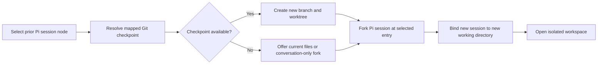
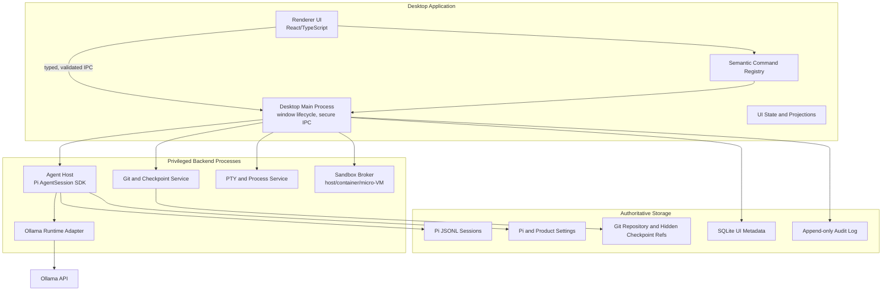
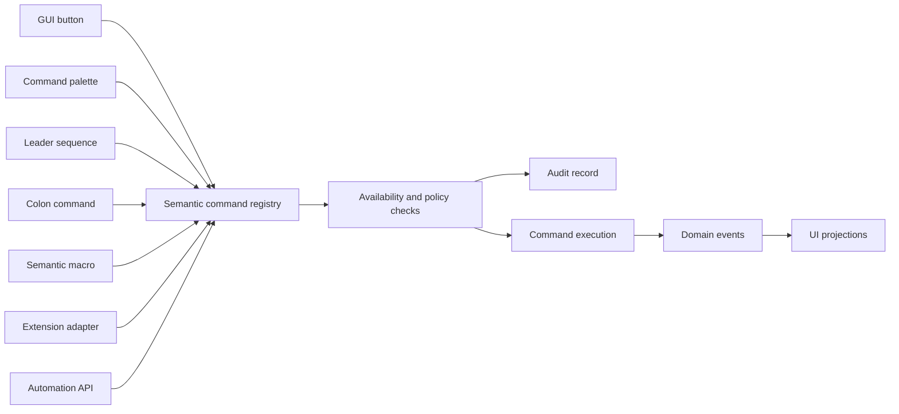
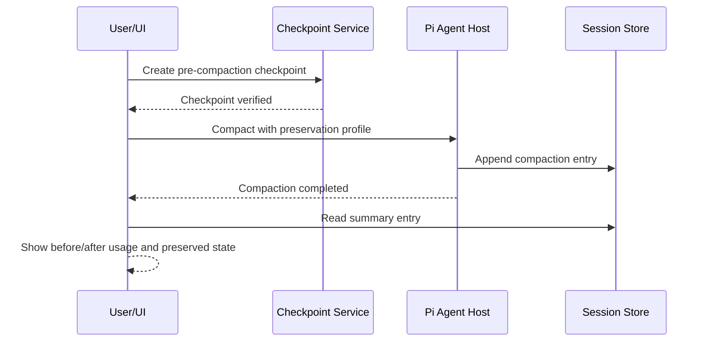
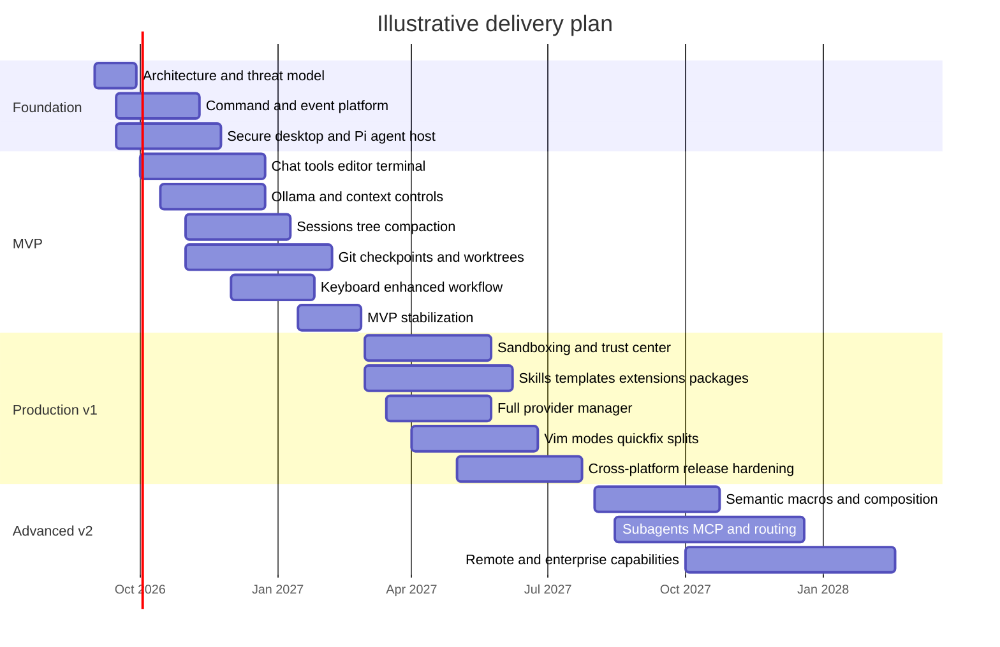

# Production-Ready Coding-Agent UI Combining Pi, Ollama, and Neovim-Style Interaction

## Executive summary

The proposed product is technically coherent and meaningfully differentiated, but only if it is built as a layered development environment rather than as a graphical wrapper around Pi. The recommended product definition is:

> **A local-first, keyboard-composable coding workspace that uses Pi as its agent kernel, Ollama as its first-class local model runtime, and Git as the authoritative source-code history.**

Pi should own agent execution, tool calls, model state, context compaction, skills, extensions, templates, and conversation sessions. Git should own code snapshots, branches, and worktrees. The application should connect individual Pi session entries to Git checkpoints so that a user can select an earlier prompt, restore the corresponding code state, fork the conversation, and continue in an isolated worktree. Pi’s native sessions are append-only JSONL trees linked through stable `id` and `parentId` fields; they are not filesystem snapshots, which is why a separate Git checkpoint layer is indispensable. citeturn14search4turn14search22turn15search13

The strongest implementation path is a **desktop-first Electron application written in TypeScript**, with the Pi SDK running in a dedicated Node agent-host process rather than in the renderer. Pi’s documentation explicitly recommends `AgentSession` for Node.js and TypeScript applications, while RPC is intended for subprocess-based, language-neutral integrations. Electron embeds both Chromium and Node.js and supports macOS, Windows, and Linux, making it the lowest-friction route to Pi SDK integration, terminals, Git, filesystem access, and Monaco-style editing. citeturn14search12turn13search16turn19search1turn19search14

The backend should nevertheless expose an internal, transport-neutral interface. That allows a future Tauri edition to run the same Node agent host as a sidecar or to use Pi’s JSONL RPC protocol. Tauri can provide a smaller, capability-restricted desktop shell, but packaging a Node sidecar, bridging its lifecycle, and handling RPC or local IPC adds significant operational complexity. Tauri’s current documentation supports bundled Node sidecars and granular per-window capabilities, which makes it a credible later option rather than the fastest MVP choice. citeturn14search3turn14search7turn14search15turn14search18turn14search21

The Neovim layer should not begin as a complete Vim emulator. It should begin with a **semantic application command system** that powers graphical buttons, a command palette, leader-key sequences, colon commands, macros, and extension actions. The highest-value keyboard features are universal fuzzy search, a Which-Key-style discovery overlay, rapid panel navigation, conversation folding, quickfix-style diagnostics, session-tree navigation, and split management. Full modes, registers, marks, text objects, and semantic macros should arrive after the command architecture is stable. Which-Key’s discoverable popup model and Telescope’s extensible picker architecture provide better product patterns than simply duplicating Vim keystrokes. citeturn18search0turn18search1turn13search1turn13search4

Security is a product-defining requirement, not a later hardening task. Pi runs with the permissions of its process, project trust is not a sandbox, and extensions execute arbitrary TypeScript with the same local privileges. Pi’s own security guidance recommends containers, virtual machines, micro-VMs, restricted mounts, minimal credentials, and limited network access for untrusted or unattended work. citeturn13search9turn16search3

A realistic delivery estimate, assuming a team of approximately five experienced engineers plus fractional product design, is:

| Milestone | Indicative calendar time | Product state |
|---|---:|---|
| Private MVP | 16–20 weeks | Reliable single-project local coding loop |
| Production v1 | Additional 14–18 weeks | Signed desktop release, sandboxing, extension compatibility, hardened worktrees |
| Advanced v2 | Additional 16–24 weeks | Semantic macros, multi-agent orchestration, remote hosts, broader extension platform |
| Overall production program | Roughly 10–15 months | Mature cross-platform agent workspace |

These are planning estimates rather than externally sourced benchmarks. Target operating systems, team size, available budget, licensing strategy, enterprise requirements, supported GPU classes, offline guarantees, and telemetry policy remain unspecified.

## Product scope and competitive design

### Product thesis

The product should be positioned between a terminal coding agent and a conventional IDE:

- Pi supplies a compact, extensible agent kernel.
- Ollama supplies local inference, model lifecycle, and runtime telemetry.
- Git supplies recoverable source-code state.
- The UI supplies visual review, permissions, context control, project management, and discoverable keyboard composition.
- A semantic command platform makes the same operation available through mouse, keyboard, macros, extensions, and automation.

Pi is explicitly designed as a small core extended through TypeScript extensions, skills, prompt templates, themes, and packages. Its session model, SDK, RPC mode, model/provider system, and extension APIs are consequently a strong foundation for a custom interface. citeturn14search19turn13search23turn16search2turn16search3

Current coding-agent products reinforce several useful interface patterns. The Codex desktop app organizes agents into project threads, supports parallel work, shows changes inline, allows comments on diffs, and can open changes in an editor. OpenAI also describes worktrees as a mechanism for isolating parallel agent runs. These patterns support a separation between a project-level task manager and a focused coding workspace. citeturn13search2turn13search5turn13search15turn13search19

The resulting product should therefore have two primary views:

| View | Primary purpose | Core contents |
|---|---|---|
| **Manager view** | Projects, agents, sessions, worktrees, and runtime health | Project cards, session trees, running tasks, model status, alerts |
| **Workspace view** | Focused implementation and review | Chat, code, diff, terminal, tool timeline, context inspector, diagnostics |

This dual-view structure prevents the workspace from becoming overloaded with global project orchestration while preserving a command-center experience for parallel work.

### Flagship workflow

The defining workflow is **Create Project from Prompt**:



Pi already provides in-session branching, session forking, cloning, tree retrieval, and stable session-entry identifiers. Git provides linked worktrees that can check out distinct branches simultaneously. The UI’s unique contribution is the durable mapping between these two histories. citeturn13search16turn14search4turn15search13

The user should see an explicit distinction:

| Action | Conversation effect | Code effect |
|---|---|---|
| **Continue from node** | Moves the active Pi leaf within the same session tree | No automatic filesystem restoration |
| **Fork session** | Creates a separate session from a selected user message | Uses current working directory unless the UI creates an isolated workspace |
| **Clone branch** | Copies the active Pi branch into a separate session | Uses current working directory unless separately changed |
| **Create project from prompt** | Forks from the selected node | Restores a mapped checkpoint into a new branch/worktree |
| **Create empty project from prompt** | Forks contextual intent | Starts from an empty or templated directory |

Pi’s session commands and RPC interface distinguish `fork`, `clone`, `get_entries`, and `get_tree`; the GUI should preserve those distinctions instead of combining them into one ambiguous “branch” action. citeturn13search16turn14search25

### Feature mapping

| Capability | Native Pi support | Product UI responsibility | Recommended phase |
|---|---|---|---|
| Persistent sessions | JSONL sessions grouped around working state, with tree entries and metadata. citeturn14search4turn14search22 | Session browser, search, naming, filters, locks, recovery | MVP |
| Session tree | `id`/`parentId` tree and RPC `get_tree`. citeturn14search4turn13search16 | Visual graph/tree, node previews, keyboard navigation | MVP |
| Fork and clone | Native session operations. citeturn13search16 | Explain semantics, confirm target directory, transaction handling | MVP |
| Context compaction | Automatic/manual compaction and branch summaries. citeturn14search8 | Context meter, presets, summary viewer, checkpoint-before-compact | MVP |
| Steering and follow-up | SDK/RPC support separate steering and follow-up queues. citeturn14search12turn14search25 | Editable queue panel and execution state | MVP |
| Skills | On-demand capability packages with instructions, scripts, and references. citeturn14search16 | Skill discovery, trust display, arguments, enable/disable | v1 |
| Prompt templates | Markdown files exposed as slash commands with arguments. citeturn15search10 | Visual template editor, preview, scope management | v1 |
| Extensions | Tools, commands, lifecycle interception, UI requests, persistent entries. citeturn13search23 | Compatibility bridge, permission display, logs, reload | v1 |
| Pi packages | Bundles extensions, skills, prompts, and themes. citeturn16search3 | Package manager, version locks, source review, integrity data | v1 |
| Model/provider manager | Built-in, custom, proxy, self-hosted, and extension providers. citeturn16search0turn16search2 | Connection testing, capability matrix, credentials, model overrides | MVP/v1 |
| Git checkpoints | Not a Pi session feature | Hidden checkpoint refs, dirty-tree capture, prompt mapping | MVP |
| Worktrees | Git-native linked working trees. citeturn15search13 | Lifecycle manager, collision prevention, cleanup and repair | MVP/v1 |
| Create project from prompt | Not native as an end-to-end feature | Transactional session + Git orchestration | MVP prototype, hardened in v1 |

### Model and provider strategy

The product should be **Ollama-first but provider-neutral**. Pi’s model layer can override built-in models, merge custom models, define context limits and output limits, adjust thinking-level mappings, and register entirely new providers through extensions. citeturn16search0turn16search2

| Provider class | Privacy and locality | Operational burden | Cost visibility | Best role |
|---|---|---:|---:|---|
| Local Ollama | Prompts remain local when using the local endpoint and no cloud tools; local Ollama does not require an API key. citeturn13search10turn15search9 | Medium: installation, model storage, VRAM, upgrades | Runtime time and energy, not API billing | Default local workflow |
| Ollama Cloud | Remote host accessed through Ollama API credentials. citeturn13search20 | Low | Provider billing/account usage | Hardware overflow |
| Pi built-in cloud provider | Direct provider integration and provider-specific metadata | Low to medium | Usually precise token/cost reporting | High-capability fallback |
| OpenAI-compatible self-hosted endpoint | Local or private deployment through Pi custom model configuration | High | Infrastructure cost | Enterprise/private deployment |
| Custom Pi provider extension | Supports proxies, SSO, private endpoints, and nonstandard streaming APIs. citeturn16search2 | High | Custom | Enterprise gateways and specialized runtimes |

The model selector must distinguish **declared model context** from **effective runtime context**. Ollama currently chooses default context length according to VRAM and recommends at least 64,000 tokens for agent and coding workloads. Its OpenAI-compatible API does not provide a request field for changing context length; that requires an Ollama model configuration or Modelfile. citeturn15search2turn13search0turn15search7

The UI should therefore show:

```text
Declared by Pi model profile:     128,000 tokens
Configured in Ollama:              65,536 tokens
Currently loaded context:          65,536 tokens
Pi response reserve:               16,384 tokens
Effective safe input budget:       runtime-derived value
Status:                            Configuration mismatch
```

Candidate local coding models should be shown as capability profiles, not as an unqualified quality ranking:

| Candidate | Ollama library metadata | Relevant capabilities | Product treatment |
|---|---|---|---|
| Devstral Small 2 | 24B, approximately 15 GB artifact, 384K listed context, text and image input. citeturn17search6turn17search14 | Agentic code exploration and tools according to its model card | Strong local candidate; benchmark on supported hardware |
| Devstral 2 | 123B, approximately 75 GB artifact, 256K listed context. citeturn17search10 | Larger agentic coding model | Workstation/server or cloud tier |
| Devstral | 24B, 128K context; its model page describes RTX 4090 or 32 GB Mac feasibility. citeturn17search2 | Local coding and tools | Legacy/compatibility candidate |
| Qwen family | Multiple dense and mixture-of-experts sizes are available. citeturn17search16turn17search0 | Coding, reasoning, multilingual use vary by exact tag | Require tag-level capability probing |
| General tool-capable models | Ollama supports tool calls, streaming tool calls, thinking, vision, embeddings, and structured output when the selected model supports them. citeturn17search3turn17search7turn17search11turn17search15turn17search23turn17search27 | Varies by tag and runtime version | Test capabilities instead of trusting names |

Artifact size is not a reliable minimum-memory figure. Quantization, KV-cache size, context length, GPU offload, parallel requests, and operating-system overhead all affect runtime requirements. The product should run a short capability and performance probe before designating any model “agent ready.”

## Architecture and integration decisions

### Recommended system architecture



The renderer must never receive unrestricted Node.js, filesystem, shell, or credential access. Electron recommends context isolation and careful control of IPC exposure; privileged operations should be routed through narrow, validated IPC handlers. citeturn15search0turn15search3

The recommended ownership rules are:

| State | Source of truth | Reason |
|---|---|---|
| Conversation entries and branches | Pi JSONL | Native Pi representation and compatibility |
| Current active Pi leaf | Pi session plus cached projection | Prevent divergence from kernel state |
| Source-code state | Git repository | Standard, inspectable code history |
| Prompt-to-code mapping | Product metadata database | Cross-domain relation absent from Pi and Git |
| Open tabs and panel layout | Product metadata | UI-only state |
| Runtime model state | Ollama runtime API | Actual loaded state may differ from configuration |
| Model declarations and overrides | Pi model configuration | Required for Pi requests |
| Trust decisions and approvals | Product policy store plus Pi trust data | Product-level policy must cover more than Pi resources |
| Security events | Append-only audit log | For review, support, and enterprise controls |

### SDK versus RPC

| Criterion | Pi SDK | Pi RPC |
|---|---|---|
| Integration model | Direct `AgentSession` API in Node/TypeScript | Pi subprocess with JSONL commands and events |
| Recommended by Pi for Node/TS | Yes. citeturn14search12turn13search16 | Pi recommends considering the SDK instead |
| Type safety | Strongest when using Pi types directly | Requires protocol schemas and validation |
| Process isolation | Must be added by the host application | Natural subprocess boundary |
| Latency and event handling | Direct callbacks/subscriptions | Serialization and transport overhead |
| Language neutrality | No | Yes |
| Session/tree operations | Direct session APIs | Explicit commands including tree, entries, fork, clone |
| Extension dialog UI | Can be adapted in-process | RPC provides an extension UI request/response protocol |
| TUI-only extension UI | Requires custom adaptation | `custom()` and several TUI-specific operations are unavailable or degraded in RPC. citeturn13search16 |
| Best target | Electron/Node agent host | Tauri sidecar, non-Node host, remote daemon |

**Recommendation:** use the Pi SDK inside a dedicated Node agent-host process and expose a product-owned typed IPC protocol. Do not call Pi directly from the renderer. Implement the agent host behind a `PiTransport` interface so that a future RPC adapter can replace it.

```typescript
interface PiTransport {
  startSession(input: StartSessionInput): Promise<SessionSnapshot>;
  subscribe(listener: (event: AgentEventEnvelope) => void): () => void;

  prompt(input: PromptInput): Promise<void>;
  steer(input: QueueInput): Promise<void>;
  followUp(input: QueueInput): Promise<void>;
  abort(runId: string): Promise<void>;

  getEntries(cursor?: string): Promise<EntryDelta>;
  getTree(): Promise<SessionTreeSnapshot>;
  fork(entryId: string): Promise<SessionRef>;
  clone(): Promise<SessionRef>;
  compact(input: CompactInput): Promise<CompactionResult>;

  listCommands(): Promise<RegisteredCommand[]>;
  resolveExtensionUi(
    requestId: string,
    result: unknown
  ): Promise<void>;
}
```

Pi’s RPC framing requires strict newline-delimited JSON and warns that generic line readers that split Unicode separators are not protocol compliant. Any RPC adapter should use a byte-oriented decoder and schema validation rather than ad hoc string parsing. citeturn13search16

### Core data model

The product database should store references and projections, not duplicate Pi’s entire conversation history.

```typescript
type WorkspaceTrust = "unresolved" | "trusted" | "restricted" | "denied";
type IsolationMode = "host" | "container" | "microvm" | "remote";

interface Workspace {
  id: string;
  displayName: string;
  canonicalRootPath: string;
  repositoryId?: string;
  trust: WorkspaceTrust;
  isolationMode: IsolationMode;
  activePiSessionId?: string;
  activeWorktreeId?: string;
  createdAt: string;
  updatedAt: string;
}

interface PiSessionBinding {
  id: string;
  workspaceId: string;
  piSessionPath: string;
  piSessionId?: string;
  activeLeafId?: string;
  sessionFormatVersion?: number;
  lastIndexedEntryId?: string;
  status: "active" | "closed" | "recovering" | "corrupt";
}

interface PromptCheckpoint {
  id: string;
  workspaceId: string;
  piSessionPath: string;
  piEntryId: string;
  repositoryId: string;
  gitCommit: string;
  hiddenRef: string;
  baseBranch?: string;
  dirtyFileCount: number;
  excludedPaths: string[];
  createdAt: string;
  status: "creating" | "ready" | "failed" | "deleted";
}

interface WorktreeRecord {
  id: string;
  repositoryId: string;
  promptCheckpointId?: string;
  branchName: string;
  path: string;
  headCommit: string;
  locked: boolean;
  lifecycle: "creating" | "active" | "detached" | "removing" | "orphaned";
}

interface AgentEventEnvelope<T = unknown> {
  schemaVersion: number;
  eventId: string;
  sessionId: string;
  runId?: string;
  timestamp: string;
  sequence: number;
  type: string;
  payload: T;
}
```

Pi session entries should be indexed incrementally using stable entry IDs. Pi’s RPC `get_entries` can return entries after a durable cursor and includes abandoned branches and pre-compaction history, making it suitable for building search indexes and UI projections. citeturn13search16

### Git checkpoint design

A production implementation should not create noisy commits on the user’s visible branch before every prompt. Instead, it should use hidden references such as:

```text
refs/agent-ui/checkpoints/<workspace-id>/<session-id>/<entry-id>
```

A robust checkpoint transaction should:

1. Acquire a per-repository mutation lock.
2. Resolve the repository root, Git directory, worktree state, ignored files, submodules, and sparse-checkout state.
3. Apply an explicit secret and exclusion policy.
4. Build a snapshot using an isolated temporary Git index.
5. Create a tree and checkpoint commit without changing the user’s current index or branch.
6. Update the hidden reference atomically.
7. Store the prompt-to-checkpoint mapping in SQLite.
8. Verify the commit can be read and checked out.
9. Release the lock and emit a checkpoint event.

For “Create Project from Prompt,” the application should then create a unique branch from the hidden checkpoint and add a linked worktree. Git supports multiple linked working trees, branch creation during `worktree add`, lock reasons, machine-readable porcelain output, cleanup, and repair. Git also refuses to remove an unclean worktree unless forced, which the UI must preserve rather than silently bypass. citeturn15search13

Important edge cases include submodules, Git LFS, ignored generated files, untracked secrets, nested repositories, bare repositories, case-insensitive filesystems, Windows path length, branch-name collisions, worktrees on removable volumes, and interrupted worktree creation. Git notes that support for multiple checkouts involving submodules is incomplete, so repositories with submodules need explicit warnings and additional tests. citeturn15search13

### Command registry

The command registry is the architectural center of the keyboard-first product:

```typescript
interface AppCommand<Input = unknown, Output = unknown> {
  id: string;
  title: string;
  category: string;
  description?: string;

  inputSchema?: unknown;
  defaultKeys?: Partial<Record<InteractionProfile, string[]>>;

  contexts: CommandContextKind[];
  requiredCapabilities?: string[];
  requiredTrust?: WorkspaceTrust[];
  risk: "safe" | "sensitive" | "destructive";

  repeatable: boolean;
  macroSafe: boolean;
  undoStrategy: "none" | "inverse-command" | "git-checkpoint" | "custom";

  canExecute(context: CommandContext): CommandAvailability;
  execute(
    context: CommandContext,
    input: Input,
    signal: AbortSignal
  ): Promise<Output>;
}
```

Examples include:

```text
agent.prompt
agent.stop
agent.steer
agent.followUp
context.compact
context.attachSelection
session.continueFromEntry
session.fork
session.clone
session.createProjectFromEntry
git.createCheckpoint
git.createWorktree
git.openDiff
model.select
model.load
model.unload
problems.next
panel.splitVertical
panel.focusLeft
```

Every invocation path must converge on this registry:



This avoids direct keyboard handlers that mutate component state, makes commands testable, and permits keymap customization without duplicating behavior.

## Feature system and keyboard interaction

### Core workspace pattern

A practical desktop layout is:

```text
┌─────────────────────────────────────────────────────────────────────────────┐
│ Project │ Git/worktree │ Provider/model │ Thinking │ Context │ Run status  │
├──────────────┬────────────────────────────────────┬─────────────────────────┤
│ Explorer     │ Chat / Code / Diff / Preview       │ Context inspector       │
│ Sessions     │                                    │ Runtime telemetry       │
│ Session tree │ Messages and artifacts             │ Instructions            │
│ Git          │ Tool-call timeline                 │ Skills/extensions       │
│ Problems     │ Inline review                      │ Permissions             │
├──────────────┴────────────────────────────────────┴─────────────────────────┤
│ Terminal │ Tests │ Problems │ Processes │ Agent logs │ Ollama logs          │
└─────────────────────────────────────────────────────────────────────────────┘
```

Pi’s own TUI separates startup information, messages and tool results, the editor, and a footer containing working directory, session, token/cache usage, cost, context usage, and model. The desktop UI should retain those concepts while distributing them across persistent panels. citeturn14search0

Tool calls should be rendered as structured artifacts rather than unformatted transcript text:

```text
✓ Read src/auth/session.ts
  319 lines · 1,840 estimated context tokens

✓ Edit src/auth/session.ts
  +22 −9 · View diff · Revert

● Run pnpm test --filter auth
  00:14 · Live output · Cancel

○ Approval required
  Command: rm -rf dist
  Scope: project
  [Allow once] [Allow in this session] [Deny]
```

The UI needs distinct states for queued, running, waiting for approval, completed, failed, cancelled, retried, and superseded operations. Pi emits streaming message, tool, queue, retry, compaction, and settlement events, which can drive these projections. citeturn13search16turn14search25

### Context and compaction UX

Pi compaction summarizes older content while preserving more recent work and also supports branch summarization. The UI should treat compaction entries as visible historical events rather than hiding them. citeturn14search8turn14search22

A context inspector should separate:

| Metric | Meaning |
|---|---|
| Pi model context declaration | Context limit Pi uses for planning compaction |
| Ollama configured context | Runtime configuration for the model |
| Ollama loaded context | Actual state of the running model |
| Current Pi context use | Estimated conversation/tool/system input |
| Reserved output budget | Space held for the next answer |
| Recent content kept | Exact recent content preserved during compaction |
| Summarized content | Historical material represented through compaction |
| Attached files and outputs | Explicit context objects with estimated token cost |

Recommended compaction workflow:



Preservation profiles should include:

| Profile | Intended result |
|---|---|
| Code-safe | Preserve architecture, touched files, exact errors, tests, pending edits, and commands |
| Balanced | Preserve decisions and current objectives with moderate compression |
| Maximum compression | Preserve only core objective, decisions, and next action |
| Custom | User-defined summary instructions |

Before compaction, the UI should optionally create a Git checkpoint and update durable handoff files such as `docs/current-state.md` and `docs/decisions.md`. That enhancement is outside Pi’s native behavior but reduces the consequences of lossy summarization.

### Pi resources

The resource manager should use a unified hierarchy:

```text
Agent Resources
├── Instructions
├── Skills
├── Prompt templates
├── Extensions
├── Packages
├── Providers
└── Themes
```

Skills are on-demand capability packages, while prompt templates are Markdown snippets expanded through slash commands. Packages can bundle skills, templates, extensions, and themes. Extensions can register tools, commands, lifecycle handlers, compaction behavior, user interaction, and persistent session entries. citeturn14search16turn15search10turn13search23turn16search3

Every resource card should display:

- Source and scope: global, project, package, or command line.
- Files and version.
- Trust state.
- Executable code or scripts.
- Registered tools and commands.
- Requested filesystem, process, network, and credential access.
- Last load error.
- Compatibility status with the graphical interface.
- Hash, source revision, and update availability.

Because packages and skills can execute or instruct execution with full local access, installation must never be reduced to a one-click marketplace action without source and permission review. Pi’s package documentation explicitly warns that extensions execute arbitrary code and that skills can instruct the model to run executables. citeturn16search3

### Neovim-inspired interaction model

The application should provide three profiles:

| Profile | Behavior |
|---|---|
| Standard | Conventional desktop controls, familiar shortcuts, mouse-first navigation |
| Keyboard Enhanced | Command palette, leader commands, panel navigation, search, no modal editing requirement |
| Vim | Normal, Insert, Visual, Command, and Terminal modes with composable operations |

Modes can improve efficiency, but hidden mode state produces mode slips and poor discoverability. Nielsen Norman Group recommends strong, redundant indications of the active mode and avoiding modal behavior for unsafe actions. The UI should therefore show the current mode in at least two ways—for example, a labeled status indicator and a cursor/editor-border change—and destructive commands should still require explicit policy checks regardless of mode. citeturn18search2turn18search5

#### Leader and Which-Key

Pressing the leader key should open a discoverable hierarchy:

```text
<Space>
a  Agent
c  Context
f  Files
g  Git
m  Models
p  Projects
q  Problems
s  Sessions
t  Terminal and tools
w  Windows
x  Extensions
```

Which-Key’s core pattern is showing available mappings as the user enters a key sequence, including support across normal, insert, visual, operator-pending, terminal, and command modes. citeturn18search0turn18search26

The product should add command availability:

```text
Space s f   Fork from selected prompt          Available
Space s p   Create project from prompt         Available
Space g w   Create worktree                    Disabled: no Git repository
Space a c   Compact context                    Disabled: agent currently compacting
Space m u   Unload Ollama model                Requires confirmation
```

#### Telescope-style search

A universal picker should search across:

- Files and symbols
- Commands and settings
- Sessions and session-tree nodes
- Chat messages
- Tool calls and outputs
- Git branches and worktrees
- Models and providers
- Skills, templates, and extensions
- Problems, tests, and review comments

Telescope is organized around extensible pickers, sorters, and previewers; the application should follow the same architecture instead of building separate, inconsistent search dialogs. citeturn18search1

Each result should have a typed preview:

```text
Session node      Prompt, model, time, files changed, checkpoint
File              Syntax preview, symbol path, Git status
Command           Description, keybindings, availability
Model             Size, context, capabilities, loaded state
Problem           Location, source, severity, associated agent run
```

#### Folding

Foldable units should include complete turns, tool-call groups, individual outputs, code blocks, diffs, reasoning summaries, branch summaries, compaction summaries, and subagent traces. Neovim’s folding model demonstrates the value of presenting a meaningful summary line for hidden content. citeturn13search7

Example:

```text
▶ 23 tool operations · 11 files read · 4 edited · 2 tests failed · 58 s
```

#### Marks and jump history

Marks should be typed references rather than raw screen positions:

```typescript
type WorkspaceMark =
  | { kind: "file"; path: string; line: number; column: number }
  | { kind: "message"; sessionId: string; entryId: string }
  | { kind: "tool-call"; sessionId: string; toolCallId: string }
  | { kind: "problem"; problemId: string }
  | { kind: "diff"; repositoryId: string; filePath: string; hunkId: string }
  | { kind: "session-node"; sessionId: string; entryId: string };
```

Neovim marks remember positions, including marks that work within a file and marks that work across files. A product-level jump list can generalize this from files to conversation and agent artifacts. citeturn13search11

#### Registers

Registers should hold typed payloads:

| Register payload | Example |
|---|---|
| Text | Prompt fragment |
| Code selection | Function plus language and source path |
| File set | Files to attach to context |
| Error | Structured diagnostic |
| Command | Shell command with working directory |
| Prompt preset | Review or testing instruction |
| Session reference | Prompt or branch node |

System clipboard integration should remain familiar; Vim register commands should be optional rather than replacing normal copy and paste.

#### Macros and repeat

Raw keystroke macros are too fragile for a graphical application. Record semantic invocations:

```json
{
  "name": "Fix next failing test",
  "steps": [
    { "command": "problems.next", "input": { "filter": "test" } },
    { "command": "problem.open" },
    { "command": "context.attachRelatedFiles" },
    { "command": "agent.runTemplate", "input": { "template": "fix-test" } },
    { "command": "tests.runRelated" }
  ]
}
```

The `.` command should repeat the previous repeatable semantic command against the current target. This is inspired by Neovim’s repeatable change model rather than by literal replay of events. citeturn13search14turn13search21

Commands involving credentials, network changes, deletion, package installation, worktree removal, or privilege changes must be marked `macroSafe: false` unless the user has created an explicit signed automation policy.

#### Splits and buffers

Neovim distinguishes buffers—the underlying content—from windows, which are views onto buffers. The UI should use the same conceptual separation: a file, session, diff, tool output, or terminal can be an open resource that appears in multiple panels. citeturn13search4

Recommended commands:

```text
Ctrl+w h/j/k/l     Focus adjacent pane
Ctrl+w v           Vertical split
Ctrl+w s           Horizontal split
Ctrl+w q           Close pane
Ctrl+w =           Equalize pane sizes
:buffer <query>    Switch resource
:close             Close current view
```

#### Quickfix-style problems

The problems system should unify compiler diagnostics, linter output, test failures, agent review findings, security findings, TODOs, and unresolved decisions:

```typescript
interface Problem {
  id: string;
  source: "compiler" | "linter" | "test" | "agent" | "security" | "user";
  severity: "error" | "warning" | "info" | "hint";
  message: string;
  filePath?: string;
  line?: number;
  column?: number;
  sessionId?: string;
  agentRunId?: string;
  toolCallId?: string;
  status: "open" | "acknowledged" | "resolved" | "stale";
}
```

Neovim’s diagnostics framework already treats diagnostics from LSPs and linters as an extension of error-handling and quickfix concepts. citeturn13search18

### Extension compatibility and migration

Pi extensions fall into three compatibility tiers:

| Tier | Pi capability | Graphical compatibility |
|---|---|---|
| Portable | Tools, commands, event handlers, custom providers, appended session entries | High; map directly into backend registries and events |
| Adaptable | Select, confirm, input, editor prompts, notifications, status and widgets | Medium to high; render through a GUI extension-UI adapter |
| TUI-specific | Arbitrary `ctx.ui.custom()`, editor replacement, header/footer manipulation, direct TUI components | Low; requires a purpose-built adapter or compatibility terminal |

Pi RPC already translates common extension dialogs into request/response messages, but several TUI operations are unavailable or no-ops in RPC mode. citeturn13search16

Recommended compatibility strategy:

1. Run trusted Pi extensions in the agent-host process, never in the renderer.
2. Map registered commands to the application command registry.
3. Render unknown tools through a generic schema-based tool card.
4. Render extension dialogs through a standard dialog protocol.
5. Preserve unknown custom session entries in storage and display a fallback JSON/details card.
6. Introduce an optional `pi-ui.json` manifest for richer graphical panels.
7. Provide a compatibility report before enabling an extension.
8. Offer an embedded Pi TUI compatibility mode for extensions that cannot be represented graphically.
9. Prevent simultaneous unsynchronized writers to the same Pi JSONL session.
10. Pin Pi and extension versions and run migration tests against the current and next supported Pi versions.

## Security, trust, and isolation

### Threat model

| Threat | Example | Required controls |
|---|---|---|
| Prompt injection from repository content | Malicious instructions in README, comments, logs, or generated output | Trust warning, least privilege, tool policies, visible context provenance |
| Malicious Pi extension or package | TypeScript extension reads SSH keys or executes shell commands | Source review, hashes, version pinning, trusted host process, optional sandbox |
| Destructive model action | Recursive deletion, force push, database reset | Risk classification, approval gate, command preview, checkpoints |
| Secret leakage | Agent reads `.env`, cloud credentials, browser data | Protected paths, secret broker, redaction, restricted mounts |
| Renderer compromise | Malicious Markdown or extension content reaches privileged IPC | Context isolation, strict CSP, sanitized rendering, narrow validated IPC |
| Exposed Ollama endpoint | Ollama bound to a non-loopback interface without suitable access control | Loopback default, endpoint warnings, authentication proxy, TLS |
| Worktree corruption | Interrupted add/remove, manual directory deletion | Transaction journal, Git porcelain state, repair workflow |
| Session corruption or incompatible format | Crash during write or Pi upgrade | Append-only ingestion, backups, schema validation, migration fixtures |
| Supply-chain compromise | Tampered installer or extension update | Signing, hashes, SBOM, provenance, staged updates |
| Unattended automation abuse | Agent runs for hours with broad credentials | Sandbox, time/resource quotas, network policy, short-lived credentials |

Pi explicitly states that project trust is an input-loading guard rather than a sandbox and that prompt injection from local files and outputs remains an expected local-agent risk. Built-in tools and extensions use the process’s local permissions. citeturn13search9

### Trust model

The project-open workflow should classify the workspace:

```text
Untrusted
  Project-local Pi resources are disabled.
  Shell and writes require approval.
  Protected paths are inaccessible.
  Sandbox strongly recommended.

Restricted
  Project resources may be inspected but not executed.
  Writes are limited to the workspace.
  Network access requires approval.

Trusted
  Approved project resources may load.
  Normal in-workspace tools can run under configured policy.

Managed
  Enterprise policy determines resources, providers, mounts, and network.
```

The trust screen should enumerate exactly what was discovered:

```text
.pi/settings.json
.pi/extensions/review.ts
.pi/skills/release/SKILL.md
.pi/prompts/deploy.md
AGENTS.md
package scripts
Git hooks
devcontainer configuration
```

Pi loads some context files independently of project extension trust, so the product should show all instruction sources and their trust implications rather than implying that “decline extension trust” means no repository content reaches the model. citeturn13search9

### Approval policy

A sensible default policy is:

| Operation | Trusted workspace | Untrusted workspace |
|---|---|---|
| Read ordinary file inside workspace | Allow | Allow with protected-path exclusions |
| Read secret-pattern file | Ask or deny | Deny |
| Write inside workspace | Allow with diff visibility | Ask |
| Write outside workspace | Ask | Deny |
| Normal test/build command | Allow | Ask or sandbox |
| Package installation | Ask | Ask in sandbox |
| Network access | Ask by destination class | Deny or ask |
| Destructive filesystem command | Always ask | Deny |
| Git commit | Ask or configured allow | Ask |
| Force push/history rewrite | Always ask | Deny |
| Worktree removal | Confirm state and uncommitted changes | Confirm and verify |
| Extension/package enablement | Review and confirm | Deny unless explicitly trusted |

An approval dialog should expose the normalized command, working directory, expanded path targets, environment-variable names, network destinations, reason, and expected effects. Approval must occur after path canonicalization and shell parsing, not against an unexpanded display string.

### Isolation modes

| Mode | Security boundary | Advantages | Limitations |
|---|---|---|---|
| Host | User account | Best compatibility and speed | No strong containment |
| Container | OS container | Reproducible, mount and network controls | Host-kernel boundary, volume writes affect host |
| Micro-VM | Virtualization boundary | Stronger isolation | Greater startup and platform complexity |
| Remote managed environment | Remote host policy | Enterprise controls and central images | Network dependency and remote credentials |

Pi recommends running the entire process in a container or VM, routing tools through a micro-VM, mounting only required workspace paths, minimizing credentials, and restricting network access. It also notes that a read/write bind mount can still modify host files. citeturn13search9

For the MVP, provide host and container modes. For v1, add a policy-controlled sandbox broker and optional micro-VM adapter. The same `ToolExecutionBackend` interface should support all modes:

```typescript
interface ToolExecutionBackend {
  mode: IsolationMode;
  startWorkspace(input: SandboxWorkspaceInput): Promise<SandboxWorkspace>;
  exec(input: ExecRequest, signal: AbortSignal): Promise<ExecHandle>;
  readFile(input: ReadRequest): Promise<Uint8Array>;
  writeFile(input: WriteRequest): Promise<void>;
  dispose(workspaceId: string): Promise<void>;
}
```

### Ollama network security

Local Ollama usage generally does not require an API key. That is convenient on loopback but dangerous if a user deliberately exposes the service beyond the local machine without an authenticated reverse proxy or network policy. citeturn13search10turn15search9

The application should:

- Default to `127.0.0.1`, not a wildcard host.
- Warn when the configured endpoint is non-loopback.
- Never embed cloud keys in renderer state.
- Store credentials through the operating system’s secure credential facility.
- Support certificate validation and pinned enterprise endpoints.
- Separate local Ollama access from Ollama Cloud credentials.
- Allow administrators to disable remote providers.
- Record provider and destination metadata without recording prompts by default.

### Desktop-shell security

For Electron:

- Enable context isolation.
- Disable Node integration in renderers.
- Enable Chromium sandboxing where compatible.
- Use a strict Content Security Policy.
- Sanitize Markdown and terminal escape sequences.
- Validate IPC senders, schemas, paths, and capabilities.
- Never expose a generic `exec`, `readFile`, or `invoke` bridge to the renderer.
- Load no remote web content in privileged windows.
- Keep Electron updated.

Electron’s security guidance emphasizes context isolation and careful separation between renderer code and privileged APIs. citeturn15search0turn15search3

For Tauri, grant only the capabilities needed by each window or webview. Tauri’s shell plugin blocks dangerous commands unless explicitly enabled, and its capabilities model supports granular grant and deny policies. citeturn14search18turn14search24

### Extension and release supply chain

Extensions should carry:

```text
Package source
Resolved version or Git commit
Content hash
Declared capabilities
Registered tools and commands
Installation time
Last update
Trust decision
Compatibility result
```

Desktop releases should be signed and accompanied by an SBOM and build provenance. SLSA defines provenance as verifiable information about where, when, and how an artifact was built, providing an appropriate framework for release integrity. citeturn19search5turn19search8turn19search12

## Operations, quality, and distribution

### Telemetry and monitoring

Telemetry should be divided into local operational telemetry and optional product analytics.

#### Local operational telemetry

| Category | Metrics |
|---|---|
| Pi | Context use, input/output/cache tokens, response reserve, compaction count, summary ratio, retries, current model |
| Ollama | Model load duration, prompt-evaluation tokens and duration, generation tokens and duration, loaded context, processor placement |
| Agent tools | Invocation count, duration, exit status, output size, approval wait, cancellation |
| Git | Checkpoint duration, changed files, worktree creation, cleanup failures |
| UI | Render latency, dropped streaming events, search latency, session-index state |
| Reliability | Process crashes, restart recovery, corrupt entries, failed migrations |

Ollama’s generation API returns load duration, prompt evaluation counts and duration, generated-token counts and duration, allowing the application to calculate prompt throughput, generation throughput, and time-to-first-use after model load. citeturn14search5

Pi’s TUI already surfaces token, cache, cost, context, and model information. A graphical product should add trend views and separate current turn, session, project, and provider totals. citeturn14search0

For local models, do not label cost as simply `$0.00`. Display:

```text
Billing: Local runtime
API charge: None
Prompt processing: 38.2 tokens/s
Generation: 21.7 tokens/s
Load time: 4.8 s
Processor: 100% GPU
Session runtime: 37 min
```

Optional power or energy estimates should be labeled estimates and disabled by default unless trustworthy hardware telemetry is available.

#### Privacy-preserving product analytics

Default analytics should exclude:

- Prompt and response text
- Source code
- File paths
- Terminal output
- Model reasoning traces
- Credentials
- Repository remotes
- Extension-provided custom data

Useful opt-in aggregate metrics include command usage, feature discoverability, crash rates, model capability-test success, worktree failures, and latency percentiles. An enterprise edition should support complete telemetry disablement and local-only audit storage.

### Testing strategy

A coding-agent UI requires deterministic platform tests and probabilistic model evaluations.

| Layer | Scope | Representative tests |
|---|---|---|
| Unit | Commands, reducers, parsers, policies | Availability, permission resolution, path canonicalization, keymap parsing |
| Contract | Pi SDK/RPC and Ollama API | Event schemas, session cursors, extension UI requests, model metadata |
| Integration | Temporary repositories and processes | Checkpoints, dirty trees, worktree lifecycle, crash recovery |
| Component | Chat, tree, diff, Which-Key, picker | Streaming state, keyboard focus, accessibility |
| Desktop E2E | Signed-like application build | Project open, prompt, approval, edit, diff, restart, update |
| Security | Renderer/backend boundaries | IPC injection, path traversal, symlink escape, malicious Markdown |
| Model evaluation | Tool behavior | Tool schema adherence, edit correctness, long-context behavior |
| Migration | Pi and product data | Old session versions, unknown entries, interrupted upgrades |
| Performance | Large sessions and repositories | 100K entries, large output, tree search, index rebuild |

Pi sessions are append-only trees and include extension entries, model changes, compactions, and branch summaries. Migration tests should therefore preserve unknown entry types rather than dropping them. citeturn14search4turn14search22

Model tests should score structured outcomes rather than exact prose:

```text
Did the model issue a valid tool call?
Did it edit only permitted files?
Did the resulting project compile?
Did the targeted test pass?
Did it stop after an approval denial?
Did it preserve required facts after compaction?
Did it avoid rereading excluded secrets?
```

Do not gate the ordinary CI pipeline on exact natural-language output from a nondeterministic model. Run a small deterministic fake-provider suite on every commit and a broader real-model matrix on scheduled or release pipelines.

Playwright provides experimental Electron automation, including launching the application, accessing windows, evaluating the main process, collecting screenshots, and stubbing native dialogs. It is useful for E2E coverage but should be supplemented by lower-level tests because its Electron support remains labeled experimental. citeturn19search9

### CI matrix

Recommended release matrix:

| Dimension | MVP | v1 |
|---|---|---|
| Operating systems | One primary OS plus smoke tests on others | Windows, macOS, Linux |
| Architectures | x64 plus developer ARM target | x64 and ARM64 where supported |
| Pi versions | Pinned supported release | Current, previous supported, candidate next |
| Ollama versions | Minimum supported and current | Minimum, current, pre-release smoke |
| Git | Minimum supported and current | Platform-default plus current |
| Repositories | Small fixtures | Monorepo, submodules, LFS, sparse checkout, large history |
| Shells | Platform default | Bash, zsh, PowerShell, cmd where applicable |
| Displays | Standard DPI | High DPI, multiple monitors, accessibility scaling |

Release gates should include:

- Unit and integration suites
- Desktop smoke tests
- Model-independent agent scenarios
- Security static analysis
- Dependency and license scanning
- SBOM generation
- Signed artifact verification
- Update-path test from the previous release
- Data migration and rollback test
- Crash-recovery test during checkpoint and compaction

### Packaging comparison

| Option | Advantages | Disadvantages | Recommendation |
|---|---|---|---|
| Electron | Direct Node/TypeScript Pi SDK integration; Chromium consistency; mature editor/terminal ecosystem; macOS, Windows, Linux support. citeturn19search1turn19search14 | Larger runtime, more memory, broad security surface | **Recommended for MVP and v1** |
| Tauri | Rust backend, system webview, granular capabilities, bundled sidecars. citeturn14search7turn14search18turn14search21 | Node sidecar packaging, cross-webview variance, more complex Pi bridge | Evaluate after transport abstraction stabilizes |
| Pure web application | Simple deployment and remote access | Cannot independently provide a full local shell/filesystem agent without a local daemon | Use as a later remote client |
| Native per-platform UI | Best platform integration | Highest implementation and maintenance cost | Not recommended initially |

Electron’s built-in updater supports macOS and Windows; Linux generally relies on distribution package managers. macOS automatic updates require a signed application. citeturn19search16turn19search22

Tauri’s updater validates signed artifacts using an embedded public key, while the signing private key must be protected because losing it can prevent future updates for installed clients. citeturn14search11

Recommended distribution targets:

| Platform | Package formats |
|---|---|
| Windows | Signed MSIX or installer, with controlled auto-update channel |
| macOS | Signed and notarized universal or architecture-specific DMG/ZIP |
| Linux | AppImage plus `.deb`/`.rpm`, with repository or package-manager updates |
| Enterprise | Offline installer, policy bundle, controlled update mirror |
| Developer build | Unsigned local build with prominent security warning |

### Product performance budgets

These are recommended design targets:

| Operation | Target |
|---|---:|
| App cold start to usable project list | Under 3 seconds on a typical development workstation |
| Workspace reopen from cached state | Under 2 seconds before background indexing |
| Keystroke-to-command feedback | Under 50 ms |
| Which-Key overlay | Under 100 ms after configured trigger |
| Universal search first results | Under 100 ms for indexed data |
| Streaming-token render delay | Under 50 ms beyond transport arrival |
| Session-tree update | Incremental; no full reparse after every entry |
| UI responsiveness during tool execution | No blocked renderer frames |
| Crash recovery | Restore session and pending transaction state on next launch |
| Worktree creation | Stream progress; no frozen UI |

Large logs and tool outputs should be virtualized, stored outside React component state, and rendered incrementally. Search indexes should use background workers and incremental entry cursors rather than reparsing full JSONL sessions.

## Delivery roadmap and prioritized checklist

### Planning assumptions

The estimates below assume:

- Five experienced engineers: three desktop/full-stack, one systems/security, and one quality/infrastructure engineer.
- Fractional product design and technical writing.
- Two-week iterations.
- Electron and TypeScript as the initial desktop stack.
- One primary operating system during early MVP development.
- Pi and Ollama are integrated as external components rather than forked.
- No enterprise identity, cloud synchronization, or collaboration in the MVP.

“Effort” is approximate person-weeks. Risk reflects uncertainty and potential for architecture or security rework.

### MVP checklist

The MVP exit criterion is a trustworthy, end-to-end local coding loop: open a project, select an Ollama model, run Pi, inspect tools, approve changes, review diffs, execute tests, manage context, branch a session, and restore a prompt into an isolated worktree.

| Priority | Deliverable | Effort | Risk | Acceptance criterion |
|---:|---|---:|---|---|
| P0 | ☐ Product architecture and threat model | 4–6 pw | High | Process boundaries, data ownership, trust states, and recovery strategy approved |
| P0 | ☐ Semantic command registry and event model | 6–8 pw | High | Buttons, palette, and keys invoke the same tested commands |
| P0 | ☐ Secure Electron shell and typed IPC | 5–7 pw | High | No Node access in renderer; IPC schemas and sender validation enforced |
| P0 | ☐ Dedicated Pi SDK agent host | 7–10 pw | High | Prompt, streaming, tools, abort, steer, follow-up, and restart recovery work |
| P0 | ☐ Pi session ingestion and indexing | 5–7 pw | Medium | JSONL entries indexed incrementally without modifying source files |
| P0 | ☐ Chat and tool-call timeline | 8–12 pw | High | Streaming, retries, tool updates, approvals, and errors render reliably |
| P0 | ☐ File explorer, code editor, diff viewer | 10–14 pw | High | Open, edit, diff, accept/revert, and Git status are usable |
| P0 | ☐ PTY terminal and process manager | 6–9 pw | High | Interactive commands, cancellation, output limits, and process cleanup work |
| P0 | ☐ Approval and protected-path policy | 6–8 pw | High | Destructive, secret, external-path, and network actions follow policy |
| P0 | ☐ Ollama discovery and health checks | 4–6 pw | Medium | Detect server/version, installed and running models, connection failures |
| P0 | ☐ Ollama model selector and capability probes | 6–8 pw | High | Tool, streaming, structured output, thinking, and context probes recorded |
| P0 | ☐ Context inspector and declared/runtime mismatch warning | 4–6 pw | Medium | Pi and Ollama limits displayed separately |
| P0 | ☐ Manual and automatic compaction UI | 5–7 pw | High | User can compact, inspect summary, and recover from failure |
| P0 | ☐ Session browser and visual session tree | 7–10 pw | High | Search, preview, continue, fork, clone, and labels work |
| P0 | ☐ Git hidden-checkpoint prototype | 8–12 pw | High | Dirty tracked and selected untracked files captured without changing user branch |
| P0 | ☐ Worktree manager | 7–10 pw | High | Create, list, lock, remove, repair, and detect unclean worktrees |
| P0 | ☐ Create Project from Prompt prototype | 8–12 pw | High | Selected Pi entry produces isolated session and code state transactionally |
| P1 | ☐ Command palette and universal search | 5–7 pw | Medium | Commands, files, sessions, messages, and models searchable |
| P1 | ☐ Leader-key and Which-Key overlay | 3–5 pw | Medium | Discoverable hierarchical mappings with availability state |
| P1 | ☐ Chat, tree, and panel keyboard navigation | 4–6 pw | Medium | Core workflow can be completed without a mouse |
| P1 | ☐ Conversation and tool folding | 3–5 pw | Low | Large turns can be collapsed without losing status |
| P0 | ☐ CI, fixtures, contract tests, crash recovery | 10–14 pw | High | Core scenarios run automatically and recover after forced termination |
| P0 | ☐ Developer packaging for primary OS | 4–6 pw | Medium | Installable test build with logs and diagnostics |
| P1 | ☐ Accessibility baseline | 3–5 pw | Medium | Focus order, screen-reader names, contrast, reduced motion, non-Vim controls |

**Indicative MVP total:** approximately 135–190 person-weeks, heavily parallelized into 16–20 calendar weeks for a five-person team. The high range reflects the difficulty of filesystem safety, Git edge cases, desktop process management, and deterministic recovery.

### Production v1 checklist

The v1 exit criterion is a signed, cross-platform release that safely supports real repositories, Pi resources, multiple providers, recoverable updates, and practical keyboard-first use.

| Priority | Deliverable | Effort | Risk | Acceptance criterion |
|---:|---|---:|---|---|
| P0 | ☐ Harden Git checkpoints and hidden refs | 8–12 pw | High | Submodules, LFS, sparse checkout, ignored files, and interrupted writes tested |
| P0 | ☐ Transaction journal and rollback engine | 6–9 pw | High | Worktree/session/checkpoint operations are idempotent and recoverable |
| P0 | ☐ Container sandbox backend | 8–12 pw | High | Restricted mounts, credentials, network, CPU, memory, and cleanup |
| P0 | ☐ Trust center and policy editor | 6–8 pw | High | Users can inspect resources, approvals, sandbox, and audit history |
| P0 | ☐ Pi skills manager | 4–6 pw | Medium | Discover, inspect, enable, invoke, and scope skills |
| P0 | ☐ Prompt-template editor and manager | 4–6 pw | Low | Global/project templates, arguments, validation, and preview |
| P0 | ☐ Extension compatibility tier A | 8–12 pw | High | Tools, commands, providers, events, and custom entries supported |
| P0 | ☐ Extension UI adapter tier B | 6–10 pw | High | Select, confirm, input, editor, notifications, and widgets mapped |
| P0 | ☐ Package manager with integrity metadata | 7–10 pw | High | Pinning, source review, hashes, enable/disable, rollback |
| P1 | ☐ Compatibility terminal for TUI-only extensions | 5–8 pw | Medium | Unsupported extensions can run without corrupting active sessions |
| P0 | ☐ Full provider and credential manager | 7–10 pw | High | Ollama, Pi built-ins, proxies, custom endpoints, secure credentials |
| P0 | ☐ Model profiles and benchmark suite | 6–9 pw | Medium | Hardware/runtime capability and performance reports available |
| P1 | ☐ Standard, Keyboard Enhanced, and Vim profiles | 5–8 pw | Medium | Profile switching preserves custom keymaps |
| P1 | ☐ Normal/Insert/Visual/Command/Terminal modes | 7–10 pw | High | Clear mode indicators and predictable focus transitions |
| P1 | ☐ Marks and jump history | 4–6 pw | Medium | Typed cross-resource marks persist and restore |
| P1 | ☐ Typed registers | 4–7 pw | Medium | Text, files, diagnostics, commands, and prompts supported |
| P1 | ☐ Quickfix-style problem system | 6–9 pw | Medium | Compiler, test, lint, agent, and security findings unified |
| P1 | ☐ Split and buffer management | 6–9 pw | Medium | Resources can be opened and navigated in multiple panes |
| P0 | ☐ Cross-platform CI and E2E | 10–14 pw | High | Windows, macOS, and Linux release candidates tested |
| P0 | ☐ Signing, notarization, SBOM, provenance | 6–9 pw | High | Verifiable artifacts and protected release keys |
| P0 | ☐ Safe updater and rollback channel | 6–9 pw | High | Previous release updates successfully; failed update recoverable |
| P0 | ☐ Privacy and telemetry controls | 4–6 pw | Medium | Local-only mode and documented opt-in analytics |
| P0 | ☐ Migration matrix for Pi and product schemas | 6–8 pw | High | Current and previous supported versions preserve sessions and metadata |
| P1 | ☐ Documentation and in-product guidance | 5–8 pw | Medium | First-run, trust, model setup, keyboard map, troubleshooting complete |

**Indicative v1 increment:** approximately 145–220 person-weeks, or an additional 14–18 calendar weeks with parallel work and a stabilized MVP architecture.

### Advanced v2 checklist

The v2 phase should deepen the platform rather than expand the MVP indiscriminately.

| Priority | Deliverable | Effort | Risk | Acceptance criterion |
|---:|---|---:|---|---|
| P1 | ☐ Semantic macro recorder and editor | 8–12 pw | High | Records typed commands, supports variables, dry runs, and policy checks |
| P1 | ☐ Repeat-last semantic action | 3–5 pw | Medium | Repeat behavior is target-aware and undoable |
| P1 | ☐ Operator and text-object framework | 8–12 pw | High | Commands compose with message, turn, diff, file, and tool objects |
| P1 | ☐ Extension graphical-panel manifest | 8–12 pw | High | Third parties can define safe declarative panels |
| P1 | ☐ MCP management | 7–10 pw | High | Servers, tools, permissions, health, and logs manageable |
| P1 | ☐ Subagent and worktree orchestration | 12–18 pw | High | Parallel agents operate in isolated worktrees with merged results |
| P1 | ☐ Model routing and fallback policies | 7–10 pw | High | Tasks route by capability, cost, locality, and availability |
| P2 | ☐ Remote host and SSH workspace support | 12–18 pw | High | Sessions, tools, Git, and model endpoints work over managed remote host |
| P2 | ☐ Thin web client backed by local/remote daemon | 10–16 pw | High | Browser UI has no direct privileged access |
| P2 | ☐ Tauri production feasibility or port | 16–30 pw | High | Sidecar, capabilities, updater, terminal, and extension compatibility validated |
| P2 | ☐ Enterprise policy bundles | 10–16 pw | High | Signed policies control providers, tools, paths, extensions, and telemetry |
| P2 | ☐ Team handoffs and shareable review artifacts | 8–12 pw | Medium | Sanitized session/diff/test artifact export |
| P2 | ☐ Extension marketplace governance | 12–20 pw | High | Signing, review, permissions, revocation, compatibility, and moderation |
| P2 | ☐ Advanced performance analytics | 6–10 pw | Medium | Compare model/runtime effectiveness without collecting source content |

### Illustrative timeline

The following assumes a kickoff on September 1, 2026 and the team described above. Dates are illustrative because budget, staffing, and release commitments are unspecified.



### Release decision gates

Do not advance from MVP to v1 until all of the following are true:

- ☐ No renderer path can issue arbitrary privileged IPC.
- ☐ Session restart and crash recovery are deterministic.
- ☐ Compaction failures do not corrupt the session or lose the active branch.
- ☐ Checkpoint creation never mutates the user’s visible branch or index.
- ☐ Worktree creation and removal are transactional and warn on uncommitted data.
- ☐ Actual Ollama runtime context is verified and displayed.
- ☐ Tool approvals cannot be bypassed through aliases, symlinks, shell expansion, or macro replay.
- ☐ A project can be opened in restricted mode without executing project-local extensions.
- ☐ Large session trees and tool outputs remain responsive.
- ☐ At least one Windows, macOS, and Linux smoke pipeline exists.
- ☐ The entire core workflow is usable in Standard mode and Keyboard Enhanced mode.
- ☐ Accessibility testing covers focus, screen readers, contrast, and non-modal alternatives.

Do not release v1 publicly until:

- ☐ Installers and updates are signed.
- ☐ SBOM and provenance are generated for every release.
- ☐ The previous supported release can update to the candidate and roll back safely.
- ☐ Pi and Ollama compatibility versions are explicit.
- ☐ Extension/package risk is clearly disclosed before installation.
- ☐ Untrusted repositories can be run in an isolated mode.
- ☐ Telemetry is documented, minimal, and disableable.
- ☐ Security reporting and update-response processes exist.
- ☐ Data export and backup procedures are documented.
- ☐ The Create Project from Prompt workflow has failure-injection coverage.

## Final assessment

This is a strong product plan, but the value does not come from maximizing the number of Pi, Ollama, or Vim features. It comes from composing them around a small set of reliable invariants:

1. **Pi owns agent and conversation state.**
2. **Git owns code history.**
3. **The application maps prompts to recoverable Git checkpoints.**
4. **Ollama is treated as a managed runtime, not merely a provider URL.**
5. **All interactions converge on a semantic command registry.**
6. **Keyboard modes are optional, visible, and discoverable.**
7. **Extensions run outside the renderer and are explicitly trusted.**
8. **Tool execution is governed by policy and, when needed, a real sandbox.**
9. **Session, Git, and worktree mutations are transactional and recoverable.**
10. **Context usage is visible and actual runtime limits take precedence over declarations.**

The most defensible initial stack is **Electron + TypeScript + a dedicated Pi SDK agent-host process + React or an equivalent renderer + SQLite projections + Git hidden checkpoint refs + an Ollama runtime adapter**. RPC should be retained behind an abstraction for non-Node hosts, Tauri, remote agents, and compatibility scenarios. Pi’s SDK and session-tree model make the agent integration practical; Ollama’s local API and runtime metrics make local model management practical; Neovim’s command composition, fuzzy navigation, windows, marks, diagnostics, and folding provide a proven vocabulary for high-speed interaction. citeturn14search12turn14search4turn14search5turn18search1turn13search4turn13search11turn13search18

The product’s clearest differentiator should remain:

> **Select any earlier prompt, recover both its conversation context and its associated code snapshot, create an isolated worktree, and continue immediately with the model and interaction style of your choice.**

That feature transforms a session tree from a chat-history visualization into a practical, reversible development system.