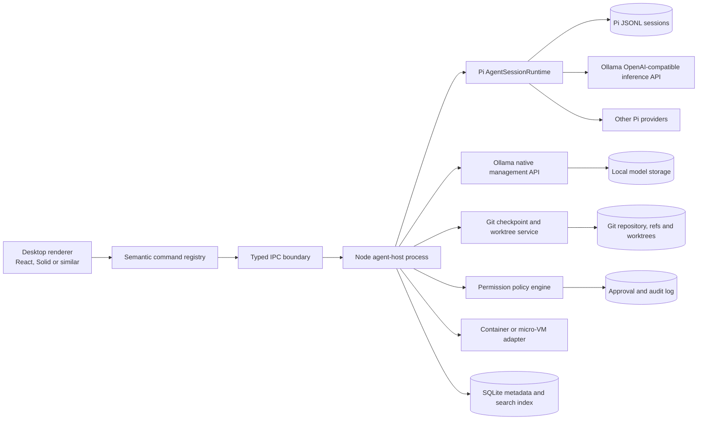
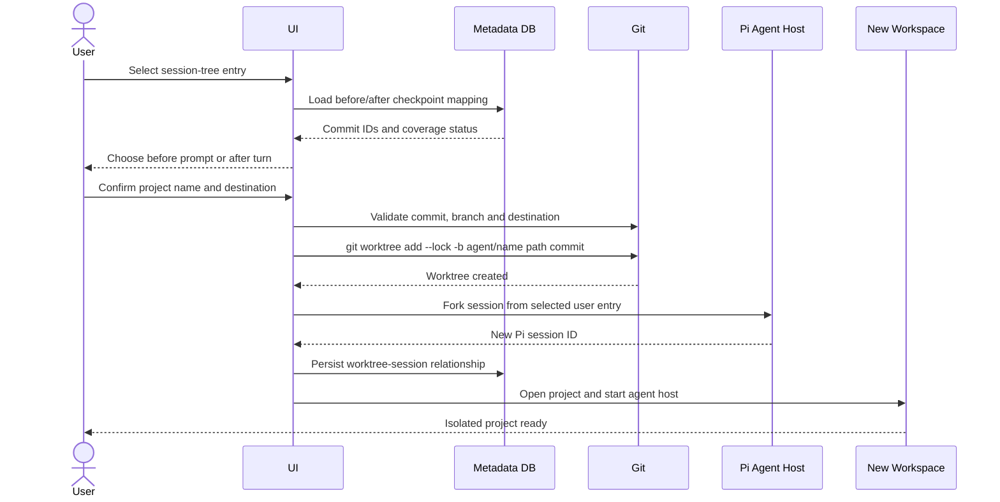

# Production Blueprint for a Pi + Ollama Coding-Agent Workspace with Optional Neovim UX

## Executive summary

**Research snapshot: August 7, 2026.** This report treats the user’s reference to “Codes” primarily as **OpenAI Codex**, while also considering **1Code** as a secondary open-source benchmark because its local-first, worktree-per-chat approach closely matches the proposed product.

The proposed product is technically coherent and strongly differentiated, but it should not be framed as “Pi plus every feature plus Ollama plus Vim keybindings.” The production-ready product definition should be:

> **A local-first agentic development workspace that embeds Pi as its agent kernel, manages Ollama as a first-class local inference runtime, maps Pi conversation branches to durable Git code states, and offers both a conventional graphical interface and an optional keyboard-composable Neovim-inspired interface.**

Pi is well suited to the agent-kernel role because it exposes a programmatic SDK, JSONL RPC mode, persistent tree-structured sessions, context compaction, extensions, skills, prompt templates, custom providers and a small built-in tool set. Pi’s maintainers intentionally keep features such as subagents and plan mode outside the minimal core so they can be implemented through extensions or surrounding applications. citeturn0search1turn0search4turn2search0

Ollama should be integrated through **two separate interfaces**:

| Integration path | Purpose |
|---|---|
| Pi → Ollama OpenAI-compatible endpoint | Model inference, streaming, tool calls and assistant responses |
| Application → Ollama native `/api` endpoints | Model discovery, model details, loading state, context allocation, pull/delete operations, keep-alive controls and telemetry |

This separation is important because Ollama’s OpenAI-compatible endpoint does not expose every runtime-management capability. For example, native Ollama endpoints expose installed models, active models, allocated context, VRAM use and timing counters; context size for OpenAI-compatible requests normally has to be configured at the Ollama model or runtime level rather than per OpenAI request. citeturn5search5turn6search0turn6search1turn15search0

The most valuable product differentiator is not chat, model selection or Vim navigation. It is the following recoverable workflow:

```text
Select a previous Pi prompt
        ↓
Identify the code checkpoint associated with that prompt
        ↓
Create a new Git worktree from that exact checkpoint
        ↓
Fork the Pi conversation into a new session
        ↓
Bind the new session to the new working directory
        ↓
Continue the experiment without modifying the original workspace
```

Pi’s session tree records conversational ancestry through entry IDs and parent IDs, but it is not a source-control system. Git worktrees provide the appropriate isolation mechanism for separate code experiments. The application must therefore maintain its own durable mapping between Pi session nodes and Git commit objects. citeturn2search2turn14search0turn12search0turn12search9

The recommended implementation is:

| Decision | Recommendation |
|---|---|
| Desktop shell | Electron for the lowest-friction SDK integration, or Tauri with a Node sidecar |
| Pi integration | Pi SDK inside a dedicated Node agent-host process |
| Alternate integration | RPC adapter for non-Node hosts, remote execution or compatibility testing |
| Frontend security | Sandboxed renderer with no direct shell, Git or filesystem authority |
| Conversation source of truth | Pi JSONL session files |
| Code-history source of truth | Git commits, refs and worktrees |
| UI metadata | SQLite |
| Local inference | Ollama |
| Other providers | Preserve Pi’s provider abstraction |
| Keyboard architecture | Central semantic command registry |
| Interaction profiles | Standard, Keyboard Enhanced and Vim |
| MVP emphasis | Reliable one-agent editing, approval, diffs, context, sessions and worktrees |
| Later emphasis | Extensions, subagents, automation, remote execution and plugin ecosystem |

A production MVP is realistically a **36–54 engineer-week project**, assuming experienced engineers and reuse of mature editor, terminal and Git libraries. A four-person team could plausibly deliver the core in approximately **three to four months**, but only if multi-agent orchestration, a plugin marketplace, complete Vim emulation and cloud collaboration are deferred.

The final product should visually resemble agent-oriented environments such as Antigravity and Codex: project-centric, multi-pane, diff-oriented and capable of isolated worktrees. Its interaction model, however, should go further by making chat history, context compaction, model-runtime state and Git checkpoints explicitly inspectable. Antigravity’s official materials emphasize agents operating across editor, terminal and browser environments, project workspaces, worktree modes and scoped security settings; Codex similarly emphasizes isolated worktrees, parallel agents, progress visibility and diff review. citeturn0search2turn0search10turn1search7turn1search11turn1search0turn1search4turn1search19

## Product definition and benchmark

The application should be positioned as an **agent development environment**, not merely an alternative chat client.

A normal coding-agent UI usually provides a conversation panel, file edits, a terminal and model settings. This product should unify five distinct state systems:

| State system | Authoritative owner | UI responsibility |
|---|---|---|
| Conversation and agent history | Pi session JSONL | Render branches, compactions, model changes and tool events |
| Source-code history | Git | Create checkpoints, diffs, branches and worktrees |
| Inference runtime | Ollama | Discover models, monitor runtime allocation and control lifecycle |
| Workspace interaction | Application | Files, editor, terminal, previews, tests and diagnostics |
| Commands and interaction | Application command registry | Connect GUI actions, keymaps, macros, extensions and automation |

This ownership separation prevents a common architectural failure: treating the chat transcript as if it were a complete replayable representation of the filesystem. Pi sessions preserve message and tool history, including branches, model changes, compactions and custom extension entries, but the files may have subsequently changed outside Pi. Exact restoration therefore requires Git or another snapshot system. citeturn2search2turn14search0

**Competitive benchmark.**

| Product | Relevant strengths | Opportunity for this product |
|---|---|---|
| Antigravity | Agent-first workspace; editor, terminal and browser interaction; worktree modes; project-level agent workflows; security controls | Add transparent Pi context management, local-runtime administration and keyboard composability |
| Codex app | Worktree isolation, multiple agents, diff review, project context, skills and long-running tasks | Offer local Ollama operation, inspectable session trees and provider independence |
| 1Code | Open-source local/cloud client; worktree-per-chat isolation; background agents and shared terminal workflows | Provide a more rigorous Pi-native session model, context UI and permission architecture |
| Pi TUI | Minimal agent kernel, tree sessions, provider switching, compaction and extensibility | Build a graphical production shell without reimplementing the agent engine |
| Neovim ecosystem | Composable commands, modal navigation, fuzzy search, quickfix, folding, marks, registers and macros | Apply semantic keyboard workflows to chat, agents, sessions and Git—not only source text |

Antigravity currently presents itself as both an editor-integrated environment and a command center for multiple agents and projects. Codex’s official application similarly uses worktrees to isolate independent tasks and supports reviewing changes before incorporating them into the primary workspace. 1Code’s public repository describes a related worktree-per-chat, local-first approach. citeturn0search2turn0search24turn1search3turn1search4turn1search12turn1search21turn16search1

**Core product principles.**

1. **Pi remains the agent kernel.** Do not rebuild message streaming, tool-call orchestration, session branching, provider routing, compaction or resource loading unless a specific Pi limitation requires an adapter.

2. **Git remains the code-history kernel.** Do not reconstruct historical source trees by replaying tool calls.

3. **Ollama is first-class but not exclusive.** Pi supports multiple providers and custom models. The UI should make Ollama exceptionally good while preserving provider-neutral interfaces. citeturn13view0turn13view1turn14search3

4. **The GUI is fully capable without Vim mode.** Every feature must be reachable through visible controls, menus and a command palette.

5. **Keyboard behavior is semantic.** A keybinding invokes `session.fork`, not “click coordinates 840, 320.”

6. **Approval is enforced outside the model.** Prompt instructions are not security boundaries. Pi itself runs with the launching user’s permissions unless isolated by the host environment. citeturn4search0turn12search8turn12search11

7. **Context is observable.** Users should see what is consuming context, when compaction will occur, what a compaction summary retained and what was lost.

8. **Conversation branches and code branches are explicitly linked.** A branch in one system must never silently imply a branch in the other.

**Recommended interaction profiles.**

| Profile | Intended user | Behavior |
|---|---|---|
| Standard | GUI-first developers | Conventional mouse, menus, tabs and familiar shortcuts |
| Keyboard Enhanced | Power users who do not want modal editing | Command palette, leader menu, panel navigation and fuzzy search |
| Vim | Neovim users | Normal/Insert/Visual/Command/Terminal modes, motions, text objects, marks, registers and semantic macros |

The profile changes the interaction method, not product capability. A Vim-only feature would create an accessibility and discoverability gap.

## Reference architecture and integration decisions

The recommended architecture places Pi in a dedicated **agent-host process**, even when using the SDK. This preserves typed in-process SDK access inside the host while keeping extension crashes, provider failures and agent workloads outside the graphical renderer.



Pi’s SDK exposes direct methods for prompting, steering, follow-ups, model changes, thinking-level changes, tree navigation, compaction, abortion and session lifecycle. The higher-level runtime can replace the active session when creating, switching, cloning or forking sessions. Pi’s documentation warns that subscriptions belong to a particular session instance, so the host must unsubscribe and rebind listeners whenever runtime session replacement occurs. citeturn2search0

**SDK versus RPC.**

| Dimension | Pi SDK | Pi RPC |
|---|---|---|
| Best host | Node.js, Electron main process or Node sidecar | Tauri, Python, Rust, remote clients or process-isolated integrations |
| Transport | Direct TypeScript calls | JSONL over standard input/output |
| Type safety | Strongest | Requires protocol types and validation |
| Process management | Application decides | Pi runs as child process |
| Session control | Direct `AgentSession` and runtime APIs | RPC commands |
| Event streaming | Direct subscription | JSONL events |
| Extension UI | Can implement custom bridges | Built-in UI subprotocol, with some TUI-only functionality degraded |
| Failure isolation | Weak if embedded in renderer; good in dedicated host process | Naturally separate process |
| Version coupling | Direct package dependency | Protocol coupling |
| Framing complexity | None | Strict line-delimited JSON handling |
| Recommended role | Primary production integration | Compatibility, remote and non-Node adapter |

Pi’s RPC documentation explicitly recommends considering direct `AgentSession` use for Node and TypeScript applications. RPC exposes agent, turn, message, Bash, tool, queue, compaction and retry events, but requires strict line-delimited JSON framing; several TUI-specific extension UI operations are unavailable or reduced in RPC mode. citeturn2search1

The optimal arrangement is therefore:

```text
Desktop renderer
    → typed IPC
Dedicated Node agent host
    → Pi SDK
Optional RPC compatibility adapter
    → remote Pi or non-Node deployment
```

This is preferable to loading Pi into the renderer. The renderer should never directly possess filesystem, Git, shell, credential or extension-execution authority.

**Minimal SDK integration.**

```typescript
import {
  createAgentSession,
  ModelRuntime,
  SessionManager,
  type AgentSession,
} from "@earendil-works/pi-coding-agent";

async function createSession(): Promise<AgentSession> {
  const modelRuntime = await ModelRuntime.create();

  const { session } = await createAgentSession({
    modelRuntime,
    sessionManager: SessionManager.inMemory(),
  });

  session.subscribe((event) => {
    if (
      event.type === "message_update" &&
      event.assistantMessageEvent.type === "text_delta"
    ) {
      process.stdout.write(event.assistantMessageEvent.delta);
    }
  });

  return session;
}

const session = await createSession();
await session.prompt("Inspect the project and explain its architecture.");
```

The package name and event-driven integration pattern are documented by Pi’s SDK guide. A production implementation should use a persisted session manager, a project-specific resource loader, error boundaries, cancellation and an adapter that normalizes Pi events before sending them to the renderer. citeturn2search0

**RPC launch and request example.**

```bash
pi --mode rpc
```

```json
{"id":"request-1","type":"prompt","message":"Run the relevant tests and summarize failures."}
```

The RPC client must parse only actual LF-delimited records, implement backpressure, detect process exit, validate every incoming event and recover from malformed or truncated lines. Pi specifically cautions against line readers that split on additional Unicode separators. citeturn2search1

**Application-owned data model.**

Pi’s JSONL remains authoritative for conversation content. The application database stores links, indexes and UI state:

```typescript
type CheckpointCoverage =
  | "tracked-only"
  | "tracked-and-untracked"
  | "partial"
  | "unavailable";

interface WorkspaceRecord {
  id: string;
  canonicalPath: string;
  displayName: string;
  repositoryRoot?: string;
  defaultProvider?: string;
  defaultModel?: string;
  sandboxProfileId?: string;
  createdAt: string;
  updatedAt: string;
}

interface PiSessionLink {
  workspaceId: string;
  piSessionId: string;
  sessionFile: string;
  activeEntryId?: string;
  parentPiSessionId?: string;
  parentEntryId?: string;
  displayName?: string;
}

interface PromptCheckpointLink {
  workspaceId: string;
  piSessionId: string;
  entryId: string;

  beforePromptCommit?: string;
  afterTurnCommit?: string;

  coverage: CheckpointCoverage;
  excludedPaths: string[];
  dirtyAtCapture: boolean;
  createdAt: string;
}

interface WorktreeRecord {
  id: string;
  sourceWorkspaceId: string;
  sourceSessionId: string;
  sourceEntryId: string;
  checkpointCommit: string;
  path: string;
  branchName: string;
  locked: boolean;
  status: "creating" | "ready" | "removing" | "failed";
}

interface ModelProfile {
  providerId: string;
  modelId: string;
  displayName: string;

  declaredContextWindow?: number;
  runtimeContextWindow?: number;
  modelMaximumContext?: number;
  effectiveContextWindow?: number;

  capabilities: {
    text: "declared" | "validated" | "failed";
    vision: "unknown" | "declared" | "validated" | "failed";
    tools: "unknown" | "declared" | "validated" | "failed";
    structuredOutput: "unknown" | "validated" | "failed";
    thinking: "unknown" | "declared" | "validated" | "failed";
  };
}
```

The `beforePromptCommit` and `afterTurnCommit` distinction is important. “Create project from this prompt” is ambiguous unless the UI asks whether the user wants:

- the code as it existed **before** the selected prompt was processed; or
- the code **after** the corresponding agent turn settled.

Pi session entries include stable tree relationships, and Git commit hashes provide durable code-state identifiers. citeturn14search0turn12search0

**Normalized event model.**

```typescript
type AgentEvent =
  | {
      type: "agent.started";
      sessionId: string;
      turnId: string;
      timestamp: number;
    }
  | {
      type: "message.delta";
      sessionId: string;
      messageId: string;
      text: string;
    }
  | {
      type: "message.completed";
      sessionId: string;
      messageId: string;
    }
  | {
      type: "tool.started";
      sessionId: string;
      toolCallId: string;
      toolName: string;
      input: unknown;
    }
  | {
      type: "tool.updated";
      sessionId: string;
      toolCallId: string;
      outputDelta: string;
    }
  | {
      type: "tool.completed";
      sessionId: string;
      toolCallId: string;
      result: unknown;
      durationMs: number;
    }
  | {
      type: "queue.changed";
      steering: QueuedPrompt[];
      followUps: QueuedPrompt[];
    }
  | {
      type: "context.compaction.started";
      reason: "manual" | "threshold" | "overflow";
    }
  | {
      type: "context.compaction.completed";
      beforeTokens: number;
      afterTokens: number;
      summaryEntryId: string;
    }
  | {
      type: "session.replaced";
      previousSessionId?: string;
      currentSessionId: string;
    }
  | {
      type: "permission.requested";
      requestId: string;
      operation: ProposedOperation;
    }
  | {
      type: "runtime.telemetry";
      modelId: string;
      telemetry: OllamaTelemetry;
    };
```

Pi’s SDK and RPC already expose most underlying lifecycle events. Normalization prevents the renderer from depending directly on Pi’s version-specific event representation. citeturn2search0turn2search1

**Semantic command registry.**

```typescript
interface CommandContext {
  workspaceId?: string;
  piSessionId?: string;
  selectedEntryId?: string;
  activePanel?: string;
  selectedFiles?: string[];
  selectedText?: string;
  invocation:
    | "button"
    | "menu"
    | "palette"
    | "keybinding"
    | "macro"
    | "extension"
    | "automation";
}

interface AppCommand<TArgs = unknown, TResult = unknown> {
  id: string;
  title: string;
  category: string;
  description?: string;

  canExecute(context: CommandContext, args: TArgs): boolean;
  execute(
    context: CommandContext,
    args: TArgs,
    signal: AbortSignal
  ): Promise<TResult>;
}

interface Keybinding {
  commandId: string;
  keys: string;
  when?: string;
  args?: unknown;
}
```

Representative commands:

```text
agent.prompt
agent.stop
agent.steer
agent.queueFollowUp
agent.retryTurn

context.compact
context.attachFile
context.excludeToolOutput
context.openInspector

session.new
session.resume
session.fork
session.clone
session.continueFromEntry
session.createProjectFromEntry

git.createCheckpoint
git.createWorktree
git.compareCheckpoint
git.removeWorktree

model.select
model.validateCapabilities
model.setThinkingLevel
ollama.pullModel
ollama.unloadModel

panel.focus
panel.splitVertical
panel.splitHorizontal

problems.next
problems.previous
problems.open

extension.install
extension.enable
extension.reload
```

Every GUI button, command-palette entry, keybinding, colon command, macro and extension action should invoke this registry. This is the architectural foundation of optional Neovim behavior.

## Core workflows and interaction design

**Primary workspace layout.**

```text
┌─────────────────────────────────────────────────────────────────────────────┐
│ Project │ Git branch │ Provider / Model │ Thinking │ Context │ Agent state │
├────────────────┬────────────────────────────────────┬───────────────────────┤
│ Files          │ Chat / Editor / Diff / Preview     │ Context Inspector     │
│ Sessions       │                                    │ Model Runtime         │
│ Session Tree   │ Message stream                     │ Attached Files        │
│ Git            │ Tool-call timeline                 │ Skills / Instructions │
│ Agents         │ Diffs and approvals                │ Permissions           │
│ Extensions     │                                    │                       │
├────────────────┴────────────────────────────────────┴───────────────────────┤
│ Terminal │ Problems │ Tests │ Processes │ Agent Logs │ Ollama Logs          │
└─────────────────────────────────────────────────────────────────────────────┘
```

The layout should remain usable with the left and right sidebars hidden. Chat, editor, diff and terminal should be independently splittable.

**Tool-call timeline.**

Pi’s event model supports start, incremental update and completion states for tool and Bash executions. The GUI should render each call as a structured, virtualized card instead of placing raw command output inline with assistant prose. citeturn2search1

```text
✓ Read src/auth/service.ts
  284 lines · 16 ms · 3.8K context tokens

✓ Edit src/auth/service.ts
  +14 −7 · View diff · Revert

● Run npm test -- auth
  00:19 elapsed · 122 output lines
  [Open live output] [Stop]

○ Approval required
  rm -rf dist/
  Scope: project/generated-output
  [Allow once] [Allow for session] [Deny]
```

Each card should expose:

| Field | Purpose |
|---|---|
| Tool and status | Immediate understanding of what the agent is doing |
| Input summary | Review intent without expanding raw JSON |
| Working directory | Prevent unnoticed execution in the wrong workspace |
| Duration | Detect stuck operations |
| Output volume | Identify context-heavy logs |
| Context inclusion | Distinguish agent-visible and private output |
| Files touched | Link execution to diffs |
| Approval record | Audit who allowed the action |
| Raw event data | Troubleshooting and extension compatibility |

**Terminal modes.**

Pi supports two shell-input forms:

```text
!npm test
```

The command runs and its output is added to model context.

```text
!!git status
```

The command runs without its output being added to model context. Pi records the latter as an excluded-from-context Bash execution message. citeturn3search0turn14search0

The GUI should express the same distinction explicitly:

```text
Run command

$ npm test

Context handling:
● Send summarized output to the agent
○ Send complete output to the agent
○ Keep output private

[Run]
```

The UI may default `!` to summarized output rather than blindly injecting thousands of terminal lines, while still preserving Pi-compatible semantics. A visible badge should identify whether a result entered context.

**File-aware input.**

Pi’s interactive interface supports fuzzy `@` file references, path completion, pasted or dragged images, multiline prompts and external-editor composition. It also distinguishes steering messages from follow-up messages while an agent is running. citeturn3search0

The graphical composer should support:

```text
@src/auth/service.ts
@docs/architecture.md
#selection
#current-diff
#terminal:last
#problems:auth
```

Each attachment should show its estimated token cost and policy:

| Policy | Meaning |
|---|---|
| Read when needed | Give the agent a path, not the whole content immediately |
| Include once | Insert content into the next turn only |
| Pin for session | Keep as durable working context |
| Summarize | Attach a generated summary and retain a link to the source |
| Exclude | Remove from the pending turn |

**Session-tree workflow.**

Pi sessions are JSONL trees. `/tree` navigates within the same session, `/fork` creates a separate session from an earlier user message, and `/clone` duplicates the active branch into another session. Optional branch summarization can preserve useful conclusions from a branch being left. citeturn2search2

The visual tree should provide:

```text
Build local coding workspace
│
├── Use Electron
│   ├── Add Monaco
│   └── Add xterm.js
│
├── Use Tauri
│   ├── Add Node sidecar
│   └── Test RPC transport
│
└── Browser-only prototype
```

Node actions:

| Action | Conversation result | Code result |
|---|---|---|
| Preview | No session mutation | No filesystem mutation |
| Continue from here | Active leaf changes inside same Pi session | Current workspace remains unchanged unless restored separately |
| Fork | New Pi session | Same workspace unless a new worktree is requested |
| Clone active branch | New Pi session containing active branch | Same workspace unless a new worktree is requested |
| Create project from here | New Pi session | New worktree or project from mapped Git checkpoint |
| Compare | No mutation | Diff selected checkpoint against current state |
| Export branch | Export conversation branch | Optional patch or bundle export |

The UI must never imply that selecting an old Pi branch automatically reverts source files.

**Create project from prompt.**



Recommended Git commands:

```bash
git worktree add --lock \
  -b agent/electron-experiment \
  ../my-app-electron \
  <checkpoint-commit>
```

```bash
git worktree list --porcelain -z
```

```bash
git worktree remove ../my-app-electron
git worktree prune --dry-run
```

Git’s worktree porcelain format is intended for stable machine parsing. Git also protects against removing dirty worktrees without force and supports locking worktrees so automatic maintenance does not prune them. citeturn12search0turn12search9

The operation should be transactional:

1. Acquire a repository-scoped operation lock.
2. Validate that the checkpoint object exists.
3. Validate destination path and branch-name uniqueness.
4. Create the worktree in a temporary “creating” state.
5. Fork the Pi session.
6. Bind the new session to the worktree’s canonical path.
7. Persist all cross-links.
8. Mark the worktree ready.
9. On failure, remove any partially created worktree and retain an audit record.

For durable prompt checkpoints, prefer internal commits or refs over an ephemeral stash list. `git stash create` can create a commit object without storing it in the normal stash list, but a dedicated hidden ref or managed checkpoint branch makes retention and garbage-collection behavior more explicit. This is an architectural recommendation based on Git’s documented commit and worktree behavior. citeturn12search1turn12search0

**Context management and compaction.**

Pi’s automatic compaction condition is:

```text
contextTokens > contextWindow - reserveTokens
```

Its documented defaults are:

```json
{
  "compaction": {
    "enabled": true,
    "reserveTokens": 16384,
    "keepRecentTokens": 20000
  }
}
```

Manual compaction remains available with `/compact [instructions]`, even when automatic compaction is disabled. Extensions can intercept or replace compaction behavior. citeturn2search3turn3search1

The UI should display four separate values:

```text
Pi declared model context:       128,000
Ollama currently allocated:       65,536
Model metadata maximum:          131,072
Effective usable context:         65,536
```

The effective limit should be conservatively calculated from the minimum verified limit, not simply copied from Pi’s model configuration.

```text
Context usage
47,210 / 65,536 tokens
███████████████░░░░░ 72%

Reserved for response: 16,384
Recent tokens retained: 20,000
Automatic compaction: On
Projected threshold: 49,152
```

Because the default reserve can make a 65,536-token runtime compact around 49,152 tokens, showing only “72% full” would be misleading. The UI should also show percentage of the **compaction threshold**:

```text
Raw model context usage:      72%
Compaction-threshold usage:   96%
```

Ollama’s allocated runtime context can be read from `/api/ps`, while model details and model metadata are available from `/api/show`. Ollama’s own documentation recommends at least 64K context for agent and coding workloads, but default allocation can be much lower depending on available VRAM. citeturn5search1turn6search1turn15search0

Recommended compact dialog:

```text
Compact context

Profile:
● Code-safe
○ Balanced
○ Maximum compression
○ Custom

Preserve:
☑ Current objective and acceptance criteria
☑ Architectural decisions
☑ Files modified and why
☑ Exact unresolved errors
☑ Commands and test results
☑ Security constraints
☑ Next steps
☑ Important Git checkpoints

Keep recent tokens:       20,000
Reserve response tokens:  16,384

Before compacting:
☑ Create Git checkpoint
☑ Update current-state handoff
☑ Save active tasks

[Compact]
```

Compaction is lossy summarization, not reversible compression. Therefore, the post-compaction event should expose the summary entry and before/after token counts:

```text
Context compacted
61,438 → 27,905 tokens

Reason: manual
Summary entry: 7fa4c2e1
Git checkpoint: 84c2d91
[Inspect summary] [Compare preserved state]
```

**Model and provider management.**

A Pi Ollama provider can be configured in `~/.pi/agent/models.json`:

```json
{
  "providers": {
    "ollama": {
      "baseUrl": "http://localhost:11434/v1",
      "api": "openai-completions",
      "apiKey": "ollama",
      "models": [
        {
          "id": "qwen2.5-coder:7b",
          "name": "Qwen 2.5 Coder 7B",
          "reasoning": false,
          "input": ["text"],
          "contextWindow": 65536,
          "maxTokens": 8192,
          "compat": {
            "supportsDeveloperRole": false,
            "supportsReasoningEffort": false
          }
        }
      ]
    }
  }
}
```

Pi requires the provider to appear authenticated, although Ollama does not require a meaningful local API key. Pi supports custom compatibility flags for OpenAI-compatible providers and reloads custom model configuration when its model selector is opened. citeturn13view0

The application should generate this configuration rather than requiring manual JSON editing. It should also preserve comments or maintain a separate generated block to avoid overwriting user-managed models.

Ollama management calls:

```bash
curl http://localhost:11434/api/tags
```

```bash
curl http://localhost:11434/api/ps
```

```bash
curl http://localhost:11434/api/show \
  -d '{"model":"qwen2.5-coder:7b"}'
```

`/api/tags` exposes installed models and metadata such as size, family and quantization; `/api/ps` exposes active models, VRAM-related allocation, expiration and current context length; `/api/show` exposes model details, capabilities, templates, licenses and model metadata. citeturn6search0turn6search1turn15search0

The model manager should distinguish:

| Capability state | Meaning |
|---|---|
| Declared | Reported by model metadata or configuration |
| Validated | Passed an application conformance test |
| Failed | Declared or expected, but test failed |
| Unknown | Not tested |

Recommended validation suite:

1. Basic non-streaming generation.
2. Streaming text generation.
3. Cancellation during generation.
4. Single tool call with schema-valid arguments.
5. Tool-result replay in a subsequent message.
6. Multiple sequential tool calls.
7. Structured JSON output.
8. Image input where declared.
9. Thinking or reasoning mode where declared.
10. Context-size test near the configured allocation.
11. Recovery from Ollama restart.
12. Handling of queue overload and HTTP 503.
13. Keep-alive, unloading and reloading.
14. Unicode and large tool-result handling.

Ollama supports tool calling, structured output and model-dependent thinking behavior, but actual quality and schema fidelity vary by model. Compatibility should therefore be measured, not inferred solely from tags. citeturn5search7turn5search3turn5search14

Runtime telemetry can be calculated from Ollama’s response counters:

```typescript
interface OllamaTelemetry {
  totalDurationNs?: number;
  loadDurationNs?: number;
  promptEvalCount?: number;
  promptEvalDurationNs?: number;
  evalCount?: number;
  evalDurationNs?: number;

  promptTokensPerSecond?: number;
  generationTokensPerSecond?: number;

  allocatedContext?: number;
  modelSizeBytes?: number;
  vramBytes?: number;
  expiresAt?: string;
}

function perSecond(
  tokenCount?: number,
  durationNs?: number
): number | undefined {
  if (!tokenCount || !durationNs || durationNs <= 0) return undefined;
  return tokenCount / (durationNs / 1_000_000_000);
}
```

Ollama’s native generation API reports total, load, prompt-evaluation and generation durations along with token counts. citeturn5search2turn5search4

**Optional Neovim-inspired interaction.**

Neovim itself has a richer mode model, including Normal, Visual, Select, Insert, command-line, Ex and Terminal modes. The coding-agent UI should intentionally simplify this into five application modes: Normal, Insert, Visual, Command and Terminal. citeturn10search0

```text
NORMAL    Navigate messages, files, panels, tools and session nodes
INSERT    Type prompts or edit source
VISUAL    Select messages, turns, files, diffs or code ranges
COMMAND   Execute colon commands
TERMINAL  Send keystrokes directly to the active terminal
```

Recommended leader hierarchy:

```text
Space f    Files
Space s    Sessions
Space a    Agent
Space c    Context
Space g    Git
Space m    Models
Space t    Terminal
Space p    Projects
Space w    Windows
Space x    Extensions
Space q    Problems
```

A Which-Key-style overlay should appear after partial key sequences. Which-Key’s purpose is to show available mappings while the user types a prefix, making a large keymap discoverable. citeturn9search2

Recommended universal search:

```text
Space Space
```

Search across files, symbols, commands, projects, sessions, session-tree entries, chat messages, models, skills, templates, extensions, Git branches, diagnostics and running processes. This follows Telescope’s extensible “picker, sorter and preview” model rather than reproducing Telescope’s implementation. citeturn9search3

Chat motions:

```text
j / k        Next or previous message
J / K        Next or previous user-assistant turn
]t / [t      Next or previous tool call
]e / [e      Next or previous error
]d / [d      Next or previous diff
]c / [c      Next or previous code block
gg           First message
G            Latest message
zz           Center active item
za           Toggle fold
```

Session-tree actions:

```text
j / k        Move between nodes
h / l        Collapse or expand
Enter        Preview
c            Continue from node
f            Fork session
p            Create project from node
w            Create worktree
d            Compare checkpoint
m            Set mark
r            Rename branch label
```

Quickfix-inspired navigation should unify compiler diagnostics, failed tests, lint findings, agent review findings, unresolved tasks and security findings. Neovim’s quickfix model is a list of locations with next/previous navigation, making it a strong conceptual fit for agent-generated findings. citeturn11search0

Folding should apply to tool groups, shell output, code blocks, diffs, reasoning summaries, old turns, subagent traces and compaction summaries. Neovim’s familiar `zo`, `zc`, `za`, `zR` and `zM` vocabulary can be reused in Vim mode. citeturn11search1

Marks and jump history should span heterogeneous locations:

```text
Chat message
→ source line
→ failed test
→ tool output
→ Git diff
→ session-tree node
```

Neovim’s jump list supports backward and forward traversal with `Ctrl-O` and `Ctrl-I`, while marks provide named return points. citeturn10search1

Registers may hold text or structured application values:

```typescript
type RegisterValue =
  | { type: "text"; text: string }
  | { type: "file-reference"; paths: string[] }
  | { type: "session-entry"; sessionId: string; entryId: string }
  | { type: "tool-result"; toolCallId: string }
  | { type: "prompt-template"; templateId: string; arguments?: string[] }
  | { type: "command-sequence"; commands: RecordedCommand[] };
```

Macros should record semantic commands:

```json
[
  {
    "commandId": "problems.next",
    "args": {}
  },
  {
    "commandId": "problems.openSelected",
    "args": {}
  },
  {
    "commandId": "agent.fixSelectedProblem",
    "args": {
      "runRelatedTests": true
    }
  }
]
```

They should not record raw mouse coordinates or transient DOM focus changes. Neovim macros traditionally record and replay commands held in registers, while the dot command repeats a prior change; the proposed product should preserve the intent but represent actions in stable application-level commands. citeturn11search3turn9search7

## Security, compatibility, and validation

Pi’s project-trust feature controls whether project-local settings, packages, extensions and related resources are loaded, but it is explicitly not a sandbox. Pi normally operates with the same operating-system permissions as the launching user, and project instruction files may still influence the agent independently of whether project extensions are trusted. citeturn4search0turn13view2

A production product therefore needs four separate controls:

| Control | Question answered |
|---|---|
| Project trust | May this repository load its local Pi resources? |
| Tool permissions | May the current proposed action execute? |
| Operating-system isolation | What could execution reach if approval logic fails? |
| Credential mediation | Which secrets can a process obtain, and under what scope? |

**Recommended execution profiles.**

| Profile | Isolation | Appropriate use |
|---|---|---|
| Host | Agent tools run with user permissions | Trusted personal repositories and supervised operation |
| Restricted host | Policy engine blocks sensitive paths, commands and network operations | Normal interactive work with moderate risk |
| Tool-routed sandbox | File and shell tools run in a micro-VM or container while UI and credentials remain outside | Untrusted repositories with controlled workspace write-through |
| Fully sandboxed agent | Pi, tools and extensions run inside a container or VM | Untrusted code, unattended agents or third-party extensions |
| Remote ephemeral sandbox | Disposable remote workspace with temporary credentials | Multi-agent automation, CI-like tasks and organizational use |

Pi’s containerization documentation describes both full-container execution and tool-routing into isolated environments such as a micro-VM. It also notes that writable bind mounts can still modify host files, so containerization alone does not make a mounted workspace immutable. citeturn4search1

**Permission policy.**

```typescript
type PermissionEffect = "allow" | "ask" | "deny";

interface PermissionRule {
  id: string;
  effect: PermissionEffect;
  operation:
    | "file.read"
    | "file.write"
    | "file.delete"
    | "shell.execute"
    | "network.connect"
    | "package.install"
    | "git.mutate"
    | "credential.request"
    | "extension.load";
  pathGlob?: string;
  commandPattern?: string;
  hostPattern?: string;
  workspaceScope?: "inside" | "outside" | "any";
  reason: string;
}

interface PermissionDecision {
  requestId: string;
  effect: PermissionEffect;
  source: "policy" | "user-once" | "user-session" | "user-project";
  matchedRuleId?: string;
  timestamp: string;
}
```

Recommended defaults:

| Operation | Default |
|---|---|
| Read ordinary files inside trusted workspace | Allow |
| Write ordinary files inside trusted workspace | Allow or ask, depending on user profile |
| Read `.env`, SSH keys, cloud credentials or browser profiles | Deny |
| Write outside workspace | Ask or deny |
| Delete generated files inside workspace | Ask |
| Recursive deletion | Always ask |
| Install packages | Ask |
| Execute scripts fetched from network | Deny unless explicitly approved |
| Network access | Ask by hostname or policy |
| Git commit, branch and worktree creation | Allow with visible audit event |
| Push, force-push or repository deletion | Always ask |
| Load project extension | Require trust and source review |
| Load unknown third-party package | Ask and show capabilities |

Pi extensions execute TypeScript with full process permissions, and Pi packages can bundle executable extensions alongside skills, prompts and themes. Their installation UI must therefore show code-execution authority rather than presenting packages as harmless themes or prompt collections. citeturn3search1turn4search2

Prompt injection must be treated as expected hostile input, especially when the agent reads repository files, webpages, issue descriptions or generated logs. Security-critical limits must be enforced by the permission and sandbox layers, not by asking the model to obey a system prompt. This follows both Pi’s security guidance and OWASP’s treatment of prompt injection and excessive agency. citeturn4search0turn12search11turn12search8

**Extensions, skills and prompt templates.**

| Resource | Pi behavior | UI requirement |
|---|---|---|
| Extension | TypeScript module can register tools, commands, providers, UI hooks, compaction behavior and persistent session entries | Show source, scope, permissions, tools, commands, errors and reload state |
| Skill | On-demand instructional package with optional scripts, references and assets | Preview instructions and scripts; enable globally or per project; validate structure |
| Prompt template | Markdown file exposed as a slash command with arguments | Visual editor, argument hints, preview and insertion into composer |
| Package | Bundle of extensions, skills, prompts and themes | Show every included resource and code-execution implications |
| Theme | UI color and syntax definition | Map compatible values into application theme system |
| Custom provider | Provider registration through configuration or extension | Render provider status and capability schema |

Pi discovers global and project-local extensions and can hot-reload them. Skills follow the Agent Skills structure and use progressive disclosure: descriptions enter the system prompt, while full instructions are loaded on demand. Prompt templates are Markdown files with frontmatter and positional arguments. citeturn3search1turn3search2turn3search3turn4search2

A graphical host will not automatically support every extension’s TUI-specific rendering assumptions. Build a capability bridge:

```typescript
interface ExtensionCapabilities {
  commands: ExtensionCommandDescriptor[];
  tools: ExtensionToolDescriptor[];
  settingsSchema?: JsonSchema;
  panels?: DeclarativePanel[];
  sessionEntryRenderers?: SessionEntryRendererDescriptor[];
  notifications?: boolean;
  confirmationDialogs?: boolean;
}
```

Unknown extension tools and commands should still appear through a generic fallback renderer. Custom terminal UI components that cannot be translated should show a compatibility warning rather than silently disappearing.

**Compatibility pitfalls.**

| Pitfall | Consequence | Mitigation |
|---|---|---|
| Reusing a Pi SDK subscription after session replacement | New session events are missed | Rebind subscriptions after every new, fork, clone or switch |
| Sending a prompt while streaming without steering/follow-up behavior | SDK error or wrong queue semantics | Require explicit mode in host API |
| Treating Pi tree navigation as file restoration | Conversation and source code diverge | Require checkpoint mapping and visible code-state status |
| Declaring a larger Pi context than Ollama allocated | Overflow or premature runtime failure | Use effective minimum and validate with `/api/ps` |
| Assuming model tags guarantee tool quality | Invalid or unreliable tool calls | Run conformance tests and store validated capability state |
| Streaming tool calls without accumulating chunks correctly | Broken replay history | Assemble content, thinking and tool-call deltas before adding history |
| Using raw TUI output parsing | Fragile and lossy integration | Use SDK or documented RPC |
| Parsing RPC with a generic Unicode line splitter | Corrupted protocol framing | Split only LF-framed records |
| Running Pi in the renderer process | Extension or model failure compromises UI and filesystem boundary | Dedicated agent host |
| Treating project trust as sandboxing | Untrusted commands can still reach host resources | OS-level isolation and external policy enforcement |
| Checkpointing secrets or ignored files | Sensitive material enters internal refs | Explicit snapshot policy, ignore rules and secret scanning |
| Removing dirty worktrees automatically | User changes can be lost | Refuse cleanup unless reviewed or force-approved |
| One Git branch checked out in conflicting worktrees | Worktree creation fails | Generate unique managed branch names |
| Large tool output rendered inline | Memory and UI performance degradation | Virtualization, truncation and out-of-band log storage |
| Compaction summary treated as complete memory | Old details are silently lost | Durable handoff documents and visible summary inspection |
| Untrusted extension package loaded on host | Arbitrary code execution | Signature/source review and sandboxed extension host |

Ollama streaming responses may contain separate content, thinking and tool-call chunks that must be accumulated into coherent history. Its API is designed to remain backward compatible but is not strictly versioned, so contract tests should run against supported Ollama releases. citeturn5search9turn5search18turn15search1

**Testing and validation strategy.**

| Test layer | Required coverage |
|---|---|
| Unit tests | Command registry, keymap resolution, permission matching, context-threshold math, telemetry calculations and path normalization |
| Pi contract tests | Event normalization, session replacement, fork/clone/tree navigation, steering, follow-up queues, abort and compaction |
| RPC contract tests | LF framing, partial records, backpressure, child-process restart and unknown event handling |
| Ollama contract tests | Tags, show, ps, pull, delete, streaming, tool calls, structured output, context allocation and telemetry |
| Git integration tests | Dirty files, untracked files, ignored secrets, nested repositories, submodules, branch collisions, worktree locking and cleanup |
| Crash-recovery tests | Kill process during checkpoint, worktree creation, session fork and metadata commit |
| Security tests | Path traversal, symlinks, shell metacharacters, prompt injection, protected paths, credential access and network egress |
| UI performance tests | Sessions with thousands of events, large logs, 100K-token conversations and rapid stream deltas |
| Accessibility tests | Keyboard-only operation, screen readers, focus order, contrast and non-modal alternatives |
| Vim-mode tests | Ambiguous key sequences, timeout behavior, mode transitions, register semantics and command repeatability |
| Migration tests | Pi session-format changes, metadata schema upgrades and invalid/corrupt records |
| End-to-end acceptance | Prompt → tool approvals → edits → tests → diff review → checkpoint → worktree fork |

High-value failure-injection scenarios include:

- Ollama stops during generation.
- Pi agent host crashes after creating a worktree but before recording metadata.
- Git checkpoint succeeds but Pi fork fails.
- Disk fills while streaming a large tool log.
- The selected session entry has no valid checkpoint.
- A repository includes malicious `.pi/extensions` or instruction files.
- A model advertises tools but emits malformed arguments.
- Automatic compaction begins while a user requests a session fork.
- The renderer reconnects after the host has switched sessions.

## Prioritized implementation checklist

Effort estimates below are **engineer-weeks**, not calendar weeks. They assume experienced TypeScript/Desktop engineers, an existing design system and mature third-party editor and terminal components. Risk represents implementation and production-hardening uncertainty.

**Recommended release boundaries.**

| Release | Goal | Estimated effort |
|---|---|---:|
| Foundation prototype | Prove Pi SDK, Ollama and event rendering | 8–12 engineer-weeks |
| Production MVP | Safe, reliable single-agent coding workspace | 36–54 engineer-weeks total |
| Workflow expansion | Git-linked session branching and keyboard productivity | Additional 28–44 engineer-weeks |
| Platform expansion | Extensions, subagents, remote execution and enterprise controls | Additional 36–64 engineer-weeks |

| Phase | Checklist item | Acceptance criteria | Effort | Risk |
|---|---|---|---:|---|
| Foundation | ☐ Establish monorepo and process boundaries | Renderer, agent host and shared protocol packages build independently; renderer has no direct Node authority | 1–2 | Medium |
| Foundation | ☐ Implement typed IPC transport | Request/response, streaming events, cancellation, reconnect and protocol-version negotiation work | 2–3 | Medium |
| Foundation | ☐ Embed Pi SDK in agent host | Can create persisted session, prompt, stream, abort and dispose without renderer coupling | 2–3 | Medium |
| Foundation | ☐ Add Pi event-normalization layer | Message, tool, Bash, queue, compaction, model and session events map to stable internal types | 2–3 | High |
| Foundation | ☐ Handle session replacement correctly | New, resume, fork, clone and switch rebind subscriptions and resources without event loss | 1–2 | High |
| Foundation | ☐ Add crash-safe agent-host supervisor | Host process restarts; UI reports state loss; persisted sessions can be reopened | 2–3 | High |
| Foundation | ☐ Build project/workspace manager | Open existing folder, canonicalize paths, detect Git root and retain recent projects | 1–2 | Low |
| Foundation | ☐ Build streamed chat renderer | Virtualized messages, Markdown, code blocks, cancellation and retry operate on long sessions | 2–3 | Medium |
| Foundation | ☐ Build tool-call timeline | Start/update/end states, live output, expandable JSON and duration are visible | 2–3 | Medium |
| Foundation | ☐ Build file explorer and editor integration | Open, edit, save, reveal changes and navigate diagnostics | 3–5 | Medium |
| Foundation | ☐ Build integrated terminal | Multiple terminals, resize, process lifecycle, private-versus-agent-visible output | 3–4 | Medium |
| Foundation | ☐ Implement file-aware prompt composer | `@` search, selections, images, multiline input and token estimates work | 2–3 | Medium |
| Foundation | ☐ Implement steer and follow-up queues | User can add, edit, reorder and remove both queue types while agent streams | 1–2 | Medium |
| Foundation | ☐ Add diff and changed-file review | Per-file diffs, revert, open, stage and compare actions are reliable | 3–4 | Medium |
| Foundation | ☐ Add basic permission interception | File and shell proposals can be allowed once, for session or denied | 3–5 | High |
| Foundation | ☐ Add audit event storage | Every approval, tool call and Git mutation records actor, scope and timestamp | 1–2 | Medium |
| Ollama | ☐ Detect Ollama endpoint | Detect default endpoint, support custom endpoint and show connection errors | 1 | Low |
| Ollama | ☐ Discover installed and active models | `/api/tags`, `/api/show` and `/api/ps` data appear with loading state and context | 2–3 | Medium |
| Ollama | ☐ Generate Pi model configuration | UI safely creates and updates provider/model entries without destroying user config | 2–3 | High |
| Ollama | ☐ Implement pull, delete, load and unload controls | Progress, cancellation, disk impact and destructive confirmation work | 2–3 | Medium |
| Ollama | ☐ Display native telemetry | Load time, prompt rate, generation rate, VRAM allocation, context and expiry are visible | 2 | Low |
| Ollama | ☐ Build capability conformance tests | Tools, JSON, streaming, cancellation, vision and thinking results are persisted | 3–5 | High |
| Ollama | ☐ Validate effective context | UI compares declared, allocated and model-maximum context and warns on mismatch | 1–2 | Medium |
| Context | ☐ Build context meter | Shows raw usage, compaction-threshold usage, reserve and retained-recent values | 2–3 | Medium |
| Context | ☐ Implement manual compaction UI | Preset/custom instructions, progress, before/after counts and summary inspection work | 2–3 | High |
| Context | ☐ Support automatic compaction settings | Enable, reserve and keep-recent settings persist globally and per project | 1–2 | Medium |
| Context | ☐ Add pre-compaction safety hook | Optional Git checkpoint and handoff snapshot occur before compaction | 2–3 | High |
| Sessions | ☐ Build persisted session list | Resume, rename, search, delete and reveal session work across project paths | 2–3 | Medium |
| Sessions | ☐ Build visual session tree | Large trees virtualize; branches, compactions, labels and model changes render | 3–5 | High |
| Sessions | ☐ Implement continue, fork and clone | Behaviors match Pi semantics and show code-state warnings | 2–3 | High |
| MVP hardening | ☐ Add settings inheritance | Global and project overrides show effective value and source | 2–3 | Medium |
| MVP hardening | ☐ Add structured logging | Renderer, host, Pi adapter, Ollama, Git and permissions have correlated logs | 2–3 | Medium |
| MVP hardening | ☐ Add automatic recovery tests | Restart, corrupt session, Ollama outage and partial stream scenarios pass | 3–5 | High |
| MVP hardening | ☐ Add packaging and update path | Signed desktop builds, migration handling and rollback strategy exist | 3–5 | High |
| Workflow expansion | ☐ Design checkpoint schema | Records before-prompt and after-turn commits, coverage and excluded paths | 1–2 | Medium |
| Workflow expansion | ☐ Implement durable Git checkpoints | Captures configured tracked/untracked state without changing user branch history | 4–7 | High |
| Workflow expansion | ☐ Add prompt-to-checkpoint mapping | Mapping is transactional, repairable and visible in the session tree | 2–4 | High |
| Workflow expansion | ☐ Implement worktree lifecycle | Create, lock, list, open, remove and repair managed worktrees | 3–5 | High |
| Workflow expansion | ☐ Implement create-project-from-prompt | Selected node becomes isolated code workspace plus forked Pi session | 4–7 | Very high |
| Workflow expansion | ☐ Add branch comparison | Compare any mapped prompt checkpoint against current or another checkpoint | 2–3 | Medium |
| Workflow expansion | ☐ Build semantic command registry | Every core action has stable ID, context predicate, typed args and cancellation | 3–5 | High |
| Workflow expansion | ☐ Add command palette | Search and run all available commands with keybinding hints | 2–3 | Low |
| Workflow expansion | ☐ Add universal fuzzy search | Search files, symbols, messages, sessions, commands and models with previews | 3–5 | Medium |
| Workflow expansion | ☐ Add Which-Key leader overlay | Prefix sequences display available semantic commands and conflicts | 2–3 | Medium |
| Workflow expansion | ☐ Add chat and tree keyboard navigation | Motions, folds and actions work without breaking normal text input | 2–4 | High |
| Workflow expansion | ☐ Add folding | Tool groups, logs, code, diffs and old conversation ranges fold independently | 2–3 | Medium |
| Workflow expansion | ☐ Add unified problem list | Compiler, tests, lint, security and agent findings share navigation model | 3–5 | Medium |
| Workflow expansion | ☐ Add split-pane management | Panels can split, focus, resize and restore layout through commands | 3–5 | Medium |
| Workflow expansion | ☐ Add Standard, Enhanced and Vim profiles | Capabilities remain equal; profile changes interaction only | 2–3 | Medium |
| Resources | ☐ Add AGENTS and instruction inspector | Shows loaded global/project/override instructions and token impact | 2–3 | Medium |
| Resources | ☐ Add skills manager | Discover, inspect, validate, enable and invoke skills | 2–4 | Medium |
| Resources | ☐ Add prompt-template manager | Create, edit, validate, preview and insert templates with arguments | 2–3 | Low |
| Resources | ☐ Add extension inventory | Lists source, tools, commands, scope, permissions, errors and reload state | 3–5 | High |
| Resources | ☐ Add generic extension rendering | Unknown tools, commands, settings and entries remain usable through fallback UI | 4–7 | Very high |
| Security | ☐ Implement full policy engine | Path, command, network, credential and Git rules are evaluated outside model | 4–7 | Very high |
| Security | ☐ Add project-trust workflow | Local Pi resources are inventoried before trust, with trust-once and persistent choices | 2–3 | High |
| Security | ☐ Add protected-path and secret detection | Sensitive paths are blocked and checkpoint capture scans for accidental secrets | 3–5 | High |
| Security | ☐ Add container execution profile | Full agent can run in controlled container with minimal mounts and network policy | 5–8 | Very high |
| Security | ☐ Add tool-routed sandbox profile | Read/write/edit/Bash route to isolated environment with workspace synchronization | 6–10 | Very high |
| Platform expansion | ☐ Add RPC adapter | Same normalized events and commands work against a Pi child process or remote host | 4–6 | High |
| Platform expansion | ☐ Add subagent orchestration | Each agent has explicit workspace, model, context, permissions and lifecycle | 6–10 | Very high |
| Platform expansion | ☐ Add agent/worktree dashboard | Multiple isolated agents show status, progress, diffs and resource usage | 4–6 | High |
| Platform expansion | ☐ Add marks and jump history | Cross-panel and cross-session locations support stable backward/forward navigation | 3–5 | Medium |
| Platform expansion | ☐ Add structured registers | Text, files, prompts, session entries and command sequences can be stored and recalled | 3–5 | Medium |
| Platform expansion | ☐ Add semantic macros and dot-repeat | Stable command sequences record, inspect, edit and replay with confirmation boundaries | 5–8 | High |
| Platform expansion | ☐ Add package installation workflow | Shows bundled resources, source provenance and executable permissions | 4–6 | Very high |
| Platform expansion | ☐ Add update and compatibility matrix | Supported Pi/Ollama versions are continuously contract-tested | 3–5 | High |
| Platform expansion | ☐ Add local evaluation harness | Benchmarks tool reliability, patch success, test pass rate, speed and context behavior | 5–8 | High |
| Platform expansion | ☐ Add remote sandbox support | Disposable remote workspaces, scoped credentials and reconnectable agents work | 8–14 | Very high |

**MVP exit criteria.**

A release should not be called production-ready until a user can reliably complete this loop:

```text
Open trusted project
→ select an Ollama model
→ validate context and tool support
→ send prompt with file context
→ inspect proposed tools
→ approve or deny operations
→ watch edits and tests
→ review diffs
→ see exact context status
→ compact safely
→ resume the session after restart
→ inspect the session tree
→ fork conversation without misleading filesystem behavior
```

“Create project from prompt” may ship immediately after MVP if durable checkpointing is not ready, but it must not be simulated by merely copying the current directory. Until exact code-state mapping exists, the UI should state:

```text
No exact code checkpoint is available for this prompt.

You may:
• Fork only the conversation and use the current files
• Create a new project from the current repository state
• Cancel and enable automatic checkpoints for future prompts
```

## Reference configurations and annotated bibliography

**Pi commands to expose graphically.**

```bash
pi -c
pi -r
pi --name "Ollama UI"
pi --mode rpc
```

```text
/model
/tree
/fork
/clone
/compact
/resume
/session
/export
/share
/reload
```

Pi supports persistent sessions grouped by working directory, named and resumed sessions, tree navigation, forks, clones, compaction, export and extension reload. citeturn2search2turn3search0

**Recommended Pi settings baseline.**

```json
{
  "compaction": {
    "enabled": true,
    "reserveTokens": 16384,
    "keepRecentTokens": 20000
  },
  "skills": [
    "~/.pi/agent/skills",
    "~/.claude/skills",
    "~/.codex/skills"
  ]
}
```

Pi supports global and project settings with nested project overrides, as well as additional skill search paths. citeturn13view2turn3search2

**Recommended generated Ollama provider entry.**

```json
{
  "providers": {
    "ollama": {
      "baseUrl": "http://localhost:11434/v1",
      "api": "openai-completions",
      "apiKey": "ollama",
      "models": [
        {
          "id": "qwen2.5-coder:7b",
          "name": "Qwen 2.5 Coder 7B",
          "reasoning": false,
          "input": ["text"],
          "contextWindow": 65536,
          "maxTokens": 8192,
          "compat": {
            "supportsDeveloperRole": false,
            "supportsReasoningEffort": false
          }
        }
      ]
    }
  }
}
```

The actual context allocation must be checked independently because the number declared to Pi does not force Ollama to allocate that amount. Ollama’s context may depend on its server configuration, model configuration and available VRAM. citeturn13view0turn5search1turn5search5

**Suggested Ollama runtime configuration.**

```bash
OLLAMA_CONTEXT_LENGTH=65536 ollama serve
```

For an OpenAI-compatible model alias with a fixed context:

```text
FROM qwen2.5-coder:7b
PARAMETER num_ctx 65536
```

```bash
ollama create qwen2.5-coder-64k -f Modelfile
```

Ollama documents both server-level context configuration and `num_ctx` in a Modelfile. Larger context consumes more memory, so the UI should estimate and validate allocation instead of enabling maximum context blindly. citeturn5search1turn5search5turn5search6

**Prioritized annotated bibliography.**

| Priority | Source | Why it matters |
|---|---|---|
| Essential | **Pi SDK documentation** citeturn2search0 | Defines `AgentSession`, lifecycle, events, steering, follow-ups, compaction and session-runtime replacement; primary basis for the agent host |
| Essential | **Pi RPC documentation** citeturn2search1 | Defines JSONL transport, event types, extension UI protocol and framing pitfalls; required for sidecar or remote compatibility |
| Essential | **Pi sessions documentation** citeturn2search2 | Authoritative semantics for tree navigation, fork, clone, branch summaries and persisted sessions |
| Essential | **Pi session-format documentation** citeturn14search0 | Defines JSONL tree entries, parent relationships, message blocks and excluded Bash context |
| Essential | **Pi compaction documentation** citeturn2search3 | Gives the automatic trigger equation and default reserve/keep-recent values |
| Essential | **Pi custom-model documentation** citeturn13view0 | Provides the official Ollama configuration format and compatibility flags |
| Essential | **Pi security documentation** citeturn4search0 | Clarifies that project trust is not sandboxing and that Pi runs with user authority |
| Essential | **Pi containerization documentation** citeturn4search1 | Describes full-container and tool-routed isolation patterns and their limitations |
| Essential | **Ollama context-length documentation** citeturn5search1 | Explains context allocation, VRAM-dependent defaults and coding-agent recommendations |
| Essential | **Ollama model-list and running-model APIs** citeturn6search0turn6search1 | Basis for model discovery, runtime context, loading state, VRAM and expiry UI |
| Essential | **Ollama model-details API** citeturn15search0 | Supplies model metadata, capabilities, template and maximum-context information |
| Essential | **Git worktree documentation** citeturn12search0turn12search9 | Defines the correct source-isolation primitive and machine-readable worktree listing |
| Important | **Pi extensions documentation** citeturn3search1 | Defines extension tools, commands, UI hooks, permission interception, compaction hooks and persistent state |
| Important | **Pi skills documentation** citeturn3search2 | Defines reusable skill structure, discovery, progressive disclosure and security implications |
| Important | **Pi prompt-template documentation** citeturn3search3 | Defines Markdown slash commands, frontmatter and argument expansion |
| Important | **Pi packages documentation** citeturn4search2 | Explains packaging of executable extensions with skills, prompts and themes |
| Important | **Ollama tool-calling documentation** citeturn5search7 | Required for validating local coding models as agents rather than plain chat models |
| Important | **Ollama structured-output documentation** citeturn5search3 | Supports schema-constrained model tests and machine-readable workflows |
| Important | **Ollama generation and telemetry documentation** citeturn5search2turn5search4 | Defines timing and token counters used for runtime performance displays |
| Important | **Neovim mode documentation** citeturn10search0 | Primary reference for modal concepts and safe simplification into application modes |
| Important | **Neovim quickfix, folding and windows documentation** citeturn11search0turn11search1turn11search2 | Basis for problems navigation, collapsible agent output and pane management |
| Important | **Neovim marks, jumps, macros and repeat documentation** citeturn10search1turn11search3turn9search7 | Basis for cross-workspace navigation and semantic command replay |
| Important | **Which-Key project documentation** citeturn9search2 | Reference for discoverable prefix-key navigation |
| Important | **Telescope project documentation** citeturn9search3 | Reference for extensible fuzzy pickers with sorting and previews |
| Benchmark | **Antigravity official materials** citeturn0search2turn0search10turn1search7turn1search11 | Useful benchmark for project-centric agent operation, worktree modes and security UX |
| Benchmark | **OpenAI Codex app documentation** citeturn1search0turn1search4turn1search12turn1search19turn1search21 | Useful benchmark for worktree isolation, parallel tasks, diff review, skills and project context |
| Benchmark | **1Code repository** citeturn16search1 | Secondary open-source benchmark for local-first, worktree-per-chat agent orchestration |
| Security | **OWASP guidance on prompt injection and excessive agency** citeturn12search11turn12search8 | Supports external permission enforcement, least privilege and explicit human approval |